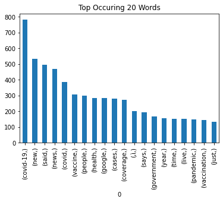
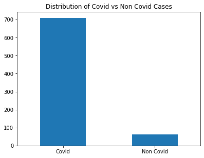
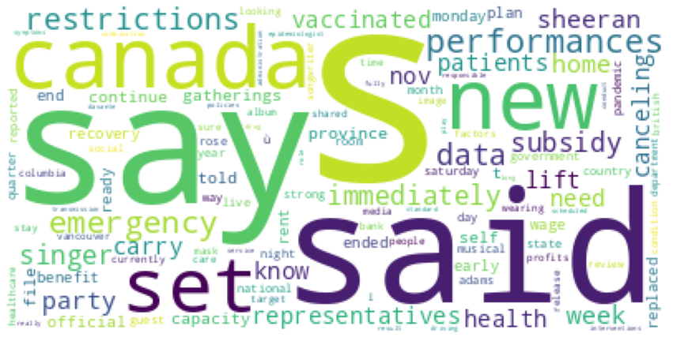
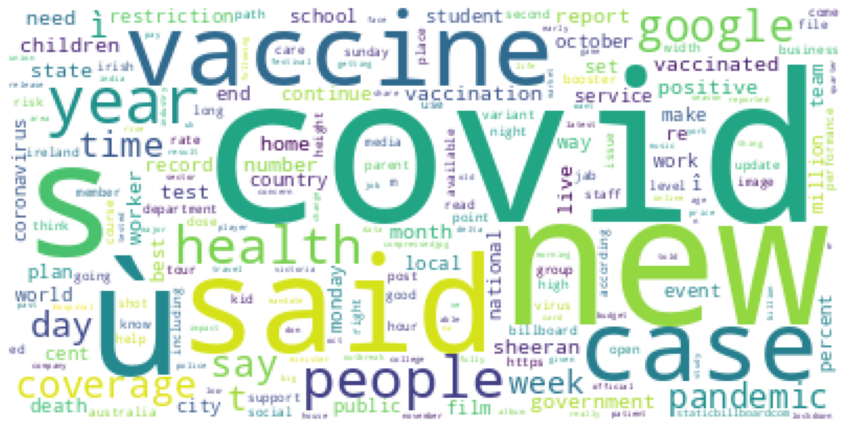
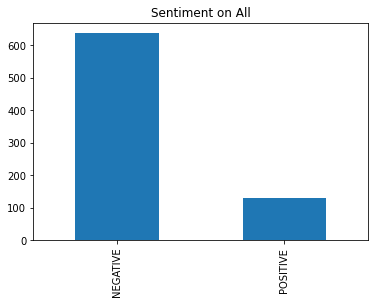

## Sentiment Analysis on News Articles - During Covid period


```python
from transformers import pipeline
import matplotlib.pyplot as plt
import pandas as pd
import re
import itertools


sentiment_pipeline = pipeline("sentiment-analysis")
```

    No model was supplied, defaulted to distilbert-base-uncased-finetuned-sst-2-english and revision af0f99b (https://huggingface.co/distilbert-base-uncased-finetuned-sst-2-english).
    Using a pipeline without specifying a model name and revision in production is not recommended.
    Some layers from the model checkpoint at distilbert-base-uncased-finetuned-sst-2-english were not used when initializing TFDistilBertForSequenceClassification: ['dropout_19']
    - This IS expected if you are initializing TFDistilBertForSequenceClassification from the checkpoint of a model trained on another task or with another architecture (e.g. initializing a BertForSequenceClassification model from a BertForPreTraining model).
    - This IS NOT expected if you are initializing TFDistilBertForSequenceClassification from the checkpoint of a model that you expect to be exactly identical (initializing a BertForSequenceClassification model from a BertForSequenceClassification model).
    Some layers of TFDistilBertForSequenceClassification were not initialized from the model checkpoint at distilbert-base-uncased-finetuned-sst-2-english and are newly initialized: ['dropout_59']
    You should probably TRAIN this model on a down-stream task to be able to use it for predictions and inference.


```python
data = pd.read_excel("News_2021_1350849078.xlsx")
```


```python
## replace nan with empty string
data["content"] = data["content"].astype(str)
data["description"] = data["description"].astype(str)

data.loc[data['content'] == 'nan','content'] = ''
data.loc[data['description'] == 'nan','description'] = ''
```


```python
data["finalText"]  = data["content"] + data["description"]
```


```python
data["finalText"]
```


    0      Covid news - live: PM insists booster jabs wil...
    1      Kolkata Municipal Corporation all set to reope...
    2      Leaked memo hints 'immediate' roll-out of Covi...
    3      Guwahati: Assam CM Himanta Biswa Sarma recentl...
    4      Kamal Baruah(The writer can be reached at kama...
                                 ...                        
    764    There has been a 20-fold increase in the numbe...
    765    What if workers had the “right to disconnect...
    766    Some students and teachers in California on Mo...
    767    MIRABEL, Quebec, Oct. 26, 2021 (GLOBE NEWSWIRE...
    768    Guwahati: The leaders of the All Assam Minorit...
    Name: finalText, Length: 769, dtype: object


```python
k = data["description"].astype("str")[0]
re.sub('[Äô¬†¬†ò,]', '', k)
```


    "Covid news - live: PM insists booster jabs will ‚protect Christmas‚ as NHS faces ‚worst winter ever‚The IndependentUK government paves way to bring in tough ‚plan B‚ Covid rulesThe GuardianGet the booster jab to save Christmas Britons urged as country faces Covid 'crunch point'Telegraph.co.ukThe Observer view on the winter crisis facing the NHSThe GuardianCOVID-19: Boris Johnson urges those eligible to get coronavirus booster jabs this winterSky NewsView Full coverage on Google News"


```python
### read the stopwords
stopWordsList = pd.read_table('file.txt',header=None)[0].to_list()
```


```python
def toList(val,stopWordsList):
    val = re.sub('[Äô¬†¬†òú.:\']', '', val)
    val = val.lower().split(" ")
    
    ## remove all the stopwords 
    filteredWords = [word for word in val if (word not in stopWordsList) and (len(word) > 1)]
    return filteredWords
```


```python
data["ListWords"] = data["finalText"].apply(lambda x: toList(x,stopWordsList))
```


```python
## Identify the covid news
def checkCOVID(val):
    covidWords = ["covid", "coronavirus", "vaccine", "vaccination", "antibody", "moderna", "pfizer", "johnson","covid-19"]
    
    for w in val:
        if w in covidWords or 'covid' in w:
            return 1
    return 0
```


```python
data["Covid"] = data["ListWords"].apply(lambda x: checkCOVID(x))
```

## Q1 : Total Words


```python
TotalWordList = data["ListWords"].to_list()
```


```python
TotalWordList = list(itertools.chain.from_iterable(TotalWordList))
```


```python
df = pd.DataFrame(TotalWordList)
ax = df.value_counts()[:20].plot(kind='bar')

print("Q1 : Top occuring 20 words ")
print("------------------------------- \n")
print(df.value_counts()[:20])

ax.set_title("Top Occuring 20 Words")
# labels = list(df.value_counts()[:20].keys().get_level_values(0))
# ax.set_xticks(labels,labels)
```

    Q1 : Top occuring 20 words 
    ------------------------------- 
    
    covid-19       781
    new            532
    said           495
    news           467
    covid          384
    vaccine        307
    people         297
    health         284
    google         283
    cases          281
    coverage       274
    ‚ì             200
    says           192
    government     165
    year           154
    time           152
    live           151
    pandemic       149
    vaccination    145
    just           131
    dtype: int64


    Text(0.5, 1.0, 'Top Occuring 20 Words')


    

    


## Q2 : Covid percentage


```python
print("Q2 :  Number of covid Cases :")
print("-----------------------------\n")
print("# Total Cases           : " , data.shape[0])
print("# Total Covid Cases     : " ,data["Covid"].value_counts()[1] )
covidCase = (data["Covid"].value_counts()[1] / data.shape[0])*100
print(f'# Total Covid Cases (%) :  {covidCase:.3f} %'  )


fig,ax = plt.subplots(figsize=(6.4,4.8))
ax = data["Covid"].value_counts().plot(kind='bar')
ax.set_title("Distribution of Covid vs Non Covid Cases")
ax.set_xticks([0,1],['Covid','Non Covid'],rotation=0)

```

    Q2 :  Number of covid Cases :
    -----------------------------
    
    # Total Cases           :  769
    # Total Covid Cases     :  708
    # Total Covid Cases (%) :  92.068 %


    [<matplotlib.axis.XTick at 0x7fe09ce1afe0>,
     <matplotlib.axis.XTick at 0x7fe09ce1afb0>]


    

    


## Q3 : Sentiment for all articles not related to covid


```python
def sentiment(val):
    val = " ".join(val)
    k = sentiment_pipeline(val[:500])
    return k[0]['label']

def sentimentPercentage(val):
    val = " ".join(val)
    k = sentiment_pipeline(val[:500])
    return k[0]['score']
```


```python
scoreList = []
sentimentlist = []
for index, row in data.iterrows():
    rowVal = row["ListWords"]
    val = " ".join(rowVal)
    k = sentiment_pipeline(val[:400])
    sentimentlist.append(k[0]['label'])
    scoreList.append(k[0]['score'])

data["Sentiment"]  = sentimentlist
data["SentimentScore"] = scoreList
```


```python
dataNonCovid = data[data["Covid"] == 0]

for index, row in dataNonCovid.iterrows():
    rowVal = " ".join(row["ListWords"])
    print('Article Text : ' , str(rowVal)[:40] , '...' , str(rowVal)[-20:])
    print('Sentiment    : ' , row['Sentiment'] , "Percentage : " , row['SentimentScore'])
```

    Article Text :  vancouver ‚î british columbia set lift c ... ly 2020 wearing mask
    Sentiment    :  NEGATIVE Percentage :  NEGATIVE
    Article Text :  vancouver ‚î british columbia set lift c ... ly 2020 wearing mask
    Sentiment    :  NEGATIVE Percentage :  NEGATIVE
    Article Text :  vancouver ‚î british columbia set lift c ... ly 2020 wearing mask
    Sentiment    :  NEGATIVE Percentage :  NEGATIVE
    Article Text :  chancellor says data does currently sugg ... ately moving plan b"
    Sentiment    :  POSITIVE Percentage :  POSITIVE
    Article Text :  department health confirmed latest figur ... st figures afternoon
    Sentiment    :  POSITIVE Percentage :  POSITIVE
    Article Text :  programs like canada emergency wage subs ... nd replaced new ones
    Sentiment    :  NEGATIVE Percentage :  NEGATIVE
    Article Text :  programs like canada emergency wage subs ... nd replaced new ones
    Sentiment    :  NEGATIVE Percentage :  NEGATIVE
    Article Text :  south african medical association says b ... vailable immediately
    Sentiment    :  POSITIVE Percentage :  POSITIVE
    Article Text :  cdc director dr rochelle stressed determ ... s resistant vaccines
    Sentiment    :  NEGATIVE Percentage :  NEGATIVE
    Article Text :  singer-songwriter says "self-isolating f ... vernment guidelines"
    Sentiment    :  NEGATIVE Percentage :  NEGATIVE
    Article Text :  shared statement fans social media ... nt fans social media
    Sentiment    :  POSITIVE Percentage :  POSITIVE
    Article Text :  singer‚s fifth album released week ...  album released week
    Sentiment    :  POSITIVE Percentage :  POSITIVE
    Article Text :  1992 law called records surrounding assa ... e wouldnt cause harm
    Sentiment    :  NEGATIVE Percentage :  NEGATIVE
    Article Text :  representatives did immediately say perf ... canceling carry home
    Sentiment    :  NEGATIVE Percentage :  NEGATIVE
    Article Text :  representatives did immediately say perf ... canceling carry home
    Sentiment    :  NEGATIVE Percentage :  NEGATIVE
    Article Text :  representatives did immediately say perf ... canceling carry home
    Sentiment    :  NEGATIVE Percentage :  NEGATIVE
    Article Text :  representatives did immediately say perf ... canceling carry home
    Sentiment    :  NEGATIVE Percentage :  NEGATIVE
    Article Text :  sheeran broke news social media days new ... media days new album
    Sentiment    :  POSITIVE Percentage :  POSITIVE
    Article Text :  "about 18 lakh beds ready hospitals toda ... h cm yogi adityanath
    Sentiment    :  NEGATIVE Percentage :  NEGATIVE
    Article Text :  sheeran‚s official website lists perform ... canceling carry home
    Sentiment    :  NEGATIVE Percentage :  NEGATIVE
    Article Text :  bc set lift capacity restrictions gather ... ings province monday
    Sentiment    :  NEGATIVE Percentage :  NEGATIVE
    Article Text :  source told page sunday "saturday night  ... singer appeals demo"
    Sentiment    :  NEGATIVE Percentage :  NEGATIVE
    Article Text :  unit stationed st andrews community cent ... unity centre tuesday
    Sentiment    :  NEGATIVE Percentage :  NEGATIVE
    Article Text :  exchange nationals‚ support climate emis ... ort continue reading
    Sentiment    :  NEGATIVE Percentage :  NEGATIVE
    Article Text :  ‚well, he‚s sick, right? he‚s fight i‚m  ... en‚s condition video
    Sentiment    :  NEGATIVE Percentage :  NEGATIVE
    Article Text :  ed sheeran shared information instagram ... nformation instagram
    Sentiment    :  POSITIVE Percentage :  POSITIVE
    Article Text :  bank announces share buyback programme $ ... ter continue reading
    Sentiment    :  NEGATIVE Percentage :  NEGATIVE
    Article Text :  restrictions lifted time 11 months count ... ic-hit economy track
    Sentiment    :  POSITIVE Percentage :  POSITIVE
    Article Text :  based previous strong sub-population ana ... 7 patients completed
    Sentiment    :  NEGATIVE Percentage :  NEGATIVE
    Article Text :  1,845 new cases reported, 497 patients h ... l, 99 intensive care
    Sentiment    :  NEGATIVE Percentage :  NEGATIVE
    Article Text :  sheeran, 30, broke news social media day ... ays new studio album
    Sentiment    :  POSITIVE Percentage :  POSITIVE
    Article Text :  two-thirds americans think people countr ... bal averages 58% 39%
    Sentiment    :  NEGATIVE Percentage :  NEGATIVE
    Article Text :  world meteorological organization warns  ... sh" climate disaster
    Sentiment    :  NEGATIVE Percentage :  NEGATIVE
    Article Text :  "we know sure factors responsible," epid ... riving transmission"
    Sentiment    :  POSITIVE Percentage :  POSITIVE
    Article Text :  "we know sure factors responsible," epid ... riving transmission"
    Sentiment    :  POSITIVE Percentage :  POSITIVE
    Article Text :  hse rolling campaign halloween period ai ... ing fully vaccinated
    Sentiment    :  NEGATIVE Percentage :  NEGATIVE
    Article Text :  "we know sure factors responsible," epid ... riving transmission"
    Sentiment    :  POSITIVE Percentage :  POSITIVE
    Article Text :  cftc investigating polymarket allows cus ... , bloomberg reported
    Sentiment    :  NEGATIVE Percentage :  NEGATIVE
    Article Text :  white house officials omb meeting indust ... final review mandate
    Sentiment    :  NEGATIVE Percentage :  NEGATIVE
    Article Text :  sheeran said self-isolating shared fulfi ... cheduled appearances
    Sentiment    :  NEGATIVE Percentage :  NEGATIVE
    Article Text :  singer-songwriter currently scheduled mu ... ngside kieran culkin
    Sentiment    :  POSITIVE Percentage :  POSITIVE
    Article Text :  comes weeks merck applied emergency use  ... nti-coronavirus drug
    Sentiment    :  NEGATIVE Percentage :  NEGATIVE
    Article Text :  massachusetts biotech said plans submit  ... ulators ‚near term‚ù
    Sentiment    :  NEGATIVE Percentage :  NEGATIVE
    Article Text :  people inclined use condoms, testing sex ... expert told guardian
    Sentiment    :  NEGATIVE Percentage :  NEGATIVE
    Article Text :  pandemic-related hospitalizations rose 2 ...  discharged past day
    Sentiment    :  NEGATIVE Percentage :  NEGATIVE
    Article Text :  singer said hell planned interviews perf ... ve musical guest nov
    Sentiment    :  NEGATIVE Percentage :  NEGATIVE
    Article Text :  leading irish obstetrician highlighted r ...  developing symptoms
    Sentiment    :  POSITIVE Percentage :  POSITIVE
    Article Text :  coroner géhane kamel elected additional ... unanswered questions
    Sentiment    :  NEGATIVE Percentage :  NEGATIVE
    Article Text :  restrictions place trump administration  ...  administration year
    Sentiment    :  NEGATIVE Percentage :  NEGATIVE
    Article Text :  davante adams ranks second nfl catches y ... nd nfl catches yards
    Sentiment    :  POSITIVE Percentage :  POSITIVE
    Article Text :  biosimulation tool conduct ‚what-if‚ sce ... re/services category
    Sentiment    :  NEGATIVE Percentage :  NEGATIVE
    Article Text :  justin trudeau major policy files facing ...  23rd prime minister
    Sentiment    :  NEGATIVE Percentage :  NEGATIVE
    Article Text :  packers likely face unbeaten cardinals 2 ... oordinator joe barry
    Sentiment    :  POSITIVE Percentage :  POSITIVE
    Article Text :  pennsylvania, 340,000 booster shots admi ... data journalism team
    Sentiment    :  NEGATIVE Percentage :  NEGATIVE
    Article Text :  plans enhance london transit bus service ... e month delayed year
    Sentiment    :  POSITIVE Percentage :  POSITIVE
    Article Text :  trevor meyer double-vaccinated experienc ... ported fraser health
    Sentiment    :  NEGATIVE Percentage :  NEGATIVE
    Article Text :  despite gov kathy hochul‚s promises tran ... ata stalling tactics
    Sentiment    :  NEGATIVE Percentage :  NEGATIVE
    Article Text :  beginning nov 8, foreign, non-immigrant  ... rior boarding flight
    Sentiment    :  NEGATIVE Percentage :  NEGATIVE
    Article Text :  new glasgow gym-goers longer able sign y ... ear-long memberships
    Sentiment    :  NEGATIVE Percentage :  NEGATIVE
    Article Text :  kerala, however, continues stay worst-af ... infections 53 deaths
    Sentiment    :  NEGATIVE Percentage :  NEGATIVE
    Article Text :  mirabel, quebec, oct 26, 2021 (globe new ... protection worldwide
    Sentiment    :  POSITIVE Percentage :  POSITIVE


## Q4 : Overall Sentiment


```python


for index, row in data.iterrows():
    rowVal = " ".join(row["ListWords"])
    print('Article Text : ' , str(rowVal)[:40] , '...' , str(rowVal)[-20:])
    print('Sentiment    : ' , row['Sentiment'] , "Percentage : " , row['SentimentScore'])
```

    Article Text :  covid news - live pm insists booster jab ... coverage google news
    Sentiment    :  NEGATIVE Percentage :  NEGATIVE
    Article Text :  kolkata municipal corporation set reopen ... id surge covid cases
    Sentiment    :  NEGATIVE Percentage :  NEGATIVE
    Article Text :  leaked memo hints immediate roll-out cov ... tionsderbyshire live
    Sentiment    :  POSITIVE Percentage :  POSITIVE
    Article Text :  guwahati assam cm himanta biswa sarma re ... dingapara tea estate
    Sentiment    :  NEGATIVE Percentage :  NEGATIVE
    Article Text :  kamal baruah(the writer reached kamalbar ... c early 20th century
    Sentiment    :  NEGATIVE Percentage :  NEGATIVE
    Article Text :  coronavirus live uk travel rules relaxed ... coverage google news
    Sentiment    :  NEGATIVE Percentage :  NEGATIVE
    Article Text :  victoria hit fully vaccinated targets mo ... coverage google news
    Sentiment    :  NEGATIVE Percentage :  NEGATIVE
    Article Text :  braves pennant win prompts gops brian ke ... coverage google news
    Sentiment    :  NEGATIVE Percentage :  NEGATIVE
    Article Text :  latest covid-19 ottawa sunday, oct 24, 2 ... sunday, oct 24, 2021
    Sentiment    :  POSITIVE Percentage :  POSITIVE
    Article Text :  vancouver ‚î british columbia set lift c ... ly 2020 wearing mask
    Sentiment    :  NEGATIVE Percentage :  NEGATIVE
    Article Text :  vancouver ‚î british columbia set lift c ... ly 2020 wearing mask
    Sentiment    :  NEGATIVE Percentage :  NEGATIVE
    Article Text :  vancouver ‚î british columbia set lift c ... ly 2020 wearing mask
    Sentiment    :  NEGATIVE Percentage :  NEGATIVE
    Article Text :  london french open champion barbora krej ... id huge expectations
    Sentiment    :  NEGATIVE Percentage :  NEGATIVE
    Article Text :  uk areas covid plan b measures introduce ... coverage google news
    Sentiment    :  NEGATIVE Percentage :  NEGATIVE
    Article Text :  covid morning briefing leaked memo detai ... coverage google news
    Sentiment    :  NEGATIVE Percentage :  NEGATIVE
    Article Text :  (bloomberg) -- continue reading read bus ... ak widen coming days
    Sentiment    :  NEGATIVE Percentage :  NEGATIVE
    Article Text :  covid news - live pm insists booster jab ... coverage google news
    Sentiment    :  NEGATIVE Percentage :  NEGATIVE
    Article Text :  tracking australias covid-19 vaccine rol ... coverage google news
    Sentiment    :  NEGATIVE Percentage :  NEGATIVE
    Article Text :  thousands protesters held rally bern, re ... s read article rtcom
    Sentiment    :  NEGATIVE Percentage :  NEGATIVE
    Article Text :  hours actor alec baldwin fired fatal gun ... sday‚s walkout ‚ì pa
    Sentiment    :  NEGATIVE Percentage :  NEGATIVE
    Article Text :  david hare furious bbc rejects covid pla ...  fiennesthe guardian
    Sentiment    :  NEGATIVE Percentage :  NEGATIVE
    Article Text :  bristol professor adam finn tells sky ne ... coverage google news
    Sentiment    :  NEGATIVE Percentage :  NEGATIVE
    Article Text :  bristol professor adam finn tells sky ne ... coverage google news
    Sentiment    :  NEGATIVE Percentage :  NEGATIVE
    Article Text :  details ‚immediate‚ winter plan b measur ... dstoke-on-trent live
    Sentiment    :  NEGATIVE Percentage :  NEGATIVE
    Article Text :  details ‚immediate‚ winter plan b measur ... coverage google news
    Sentiment    :  NEGATIVE Percentage :  NEGATIVE
    Article Text :  bennett announces nis 10 billion fight f ... ccine 5-11 age group
    Sentiment    :  NEGATIVE Percentage :  NEGATIVE
    Article Text :  atlanta braves finish la dodgers advance ... coverage google news
    Sentiment    :  NEGATIVE Percentage :  NEGATIVE
    Article Text :  health leaders urged government introduc ... ronavirus infections
    Sentiment    :  NEGATIVE Percentage :  NEGATIVE
    Article Text :  15650 runners hong kong marathon covid-1 ... coverage google news
    Sentiment    :  NEGATIVE Percentage :  NEGATIVE
    Article Text :  news analysis (file photo paul bersebach ... mentation theyd need
    Sentiment    :  NEGATIVE Percentage :  NEGATIVE
    Article Text :  117 patients, staff bukit merah polyclin ... coverage google news
    Sentiment    :  NEGATIVE Percentage :  NEGATIVE
    Article Text :  chancellor says ‚plan b‚ covid measures  ... ing continue reading
    Sentiment    :  NEGATIVE Percentage :  NEGATIVE
    Article Text :  chancellor says data does currently sugg ... ately moving plan b"
    Sentiment    :  POSITIVE Percentage :  POSITIVE
    Article Text :  yoga hula hoops join quack cures covid s ... coverage google news
    Sentiment    :  NEGATIVE Percentage :  NEGATIVE
    Article Text :  government needs different covid-19 mess ... dviserguernsey press
    Sentiment    :  NEGATIVE Percentage :  NEGATIVE
    Article Text :  dans daily penguins shake maple leafs, g ... coverage google news
    Sentiment    :  NEGATIVE Percentage :  NEGATIVE
    Article Text :  russian currency exchange transactions s ... e read article rtcom
    Sentiment    :  NEGATIVE Percentage :  NEGATIVE
    Article Text :  russian currency exchange transactions s ... e read article rtcom
    Sentiment    :  NEGATIVE Percentage :  NEGATIVE
    Article Text :  bayern munich germany star joshua kimmic ... e read article rtcom
    Sentiment    :  NEGATIVE Percentage :  NEGATIVE
    Article Text :  jennifer hubert jumped opportunity covid ... feeling trepidatious
    Sentiment    :  NEGATIVE Percentage :  NEGATIVE
    Article Text :  covid taxes, guns abortion murphy, ciatt ... coverage google news
    Sentiment    :  NEGATIVE Percentage :  NEGATIVE
    Article Text :  bring social distancing avoid meltdown,  ... coverage google news
    Sentiment    :  POSITIVE Percentage :  POSITIVE
    Article Text :  ottawa ‚î jennifer hubert jumped opportu ... year-old son jackson
    Sentiment    :  POSITIVE Percentage :  POSITIVE
    Article Text :  ottawa ‚î jennifer hubert jumped opportu ... year-old son jackson
    Sentiment    :  POSITIVE Percentage :  POSITIVE
    Article Text :  ottawa ‚î jennifer hubert jumped opportu ... year-old son jackson
    Sentiment    :  POSITIVE Percentage :  POSITIVE
    Article Text :  thousands workers getting fired refusing ... coverage google news
    Sentiment    :  NEGATIVE Percentage :  NEGATIVE
    Article Text :  parents hesitant vaccinate kids themselv ... coverage google news
    Sentiment    :  NEGATIVE Percentage :  NEGATIVE
    Article Text :  department health confirmed latest figur ... st figures afternoon
    Sentiment    :  POSITIVE Percentage :  POSITIVE
    Article Text :  hailing crossing 100 crore vaccine doses ...  new zeal new energy
    Sentiment    :  POSITIVE Percentage :  POSITIVE
    Article Text :  1,725 cases covid-19 reported state sund ... accines administered
    Sentiment    :  POSITIVE Percentage :  POSITIVE
    Article Text :  today‚s coronavirus news parents hesitan ... coverage google news
    Sentiment    :  NEGATIVE Percentage :  NEGATIVE
    Article Text :  programs like canada emergency wage subs ... nd replaced new ones
    Sentiment    :  NEGATIVE Percentage :  NEGATIVE
    Article Text :  programs like canada emergency wage subs ... nd replaced new ones
    Sentiment    :  NEGATIVE Percentage :  NEGATIVE
    Article Text :  champagne sales rise, surging numbers se ... s read article rtcom
    Sentiment    :  NEGATIVE Percentage :  NEGATIVE
    Article Text :  vaccines wont stop rising covid case sci ... coverage google news
    Sentiment    :  NEGATIVE Percentage :  NEGATIVE
    Article Text :  doctors claimed fever cough leading brea ... ealth administration
    Sentiment    :  NEGATIVE Percentage :  NEGATIVE
    Article Text :  "covid-19 creating shortages labor marke ... bor," fundstrat said
    Sentiment    :  NEGATIVE Percentage :  NEGATIVE
    Article Text :  south african medical association says b ... vailable immediately
    Sentiment    :  POSITIVE Percentage :  POSITIVE
    Article Text :  now, vaccine makers billions selling cov ... accine billionaires"
    Sentiment    :  POSITIVE Percentage :  POSITIVE
    Article Text :  sen christopher lawrence "bong" reassure ... lth safety protocols
    Sentiment    :  POSITIVE Percentage :  POSITIVE
    Article Text :  todays coronavirus news ontario reports  ... earcher saystheifpca
    Sentiment    :  NEGATIVE Percentage :  NEGATIVE
    Article Text :  400 koalas chlamydia vaccine trialinside ... coverage google news
    Sentiment    :  NEGATIVE Percentage :  NEGATIVE
    Article Text :  namibia halts use sputnik jabs south afr ... coverage google news
    Sentiment    :  NEGATIVE Percentage :  NEGATIVE
    Article Text :  pubs live music subjected new guidelines ... itional reporting pa
    Sentiment    :  NEGATIVE Percentage :  NEGATIVE
    Article Text :  latest updates medical leader says emerg ... ing continue reading
    Sentiment    :  NEGATIVE Percentage :  NEGATIVE
    Article Text :  does dodgers‚ nlcs loss forecast team‚s  ... coverage google news
    Sentiment    :  NEGATIVE Percentage :  NEGATIVE
    Article Text :  cluster model 20 here‚s govt plans ramp  ... cination rural areas
    Sentiment    :  NEGATIVE Percentage :  NEGATIVE
    Article Text :  covid-19 professors urge kind plan b war ... coverage google news
    Sentiment    :  NEGATIVE Percentage :  NEGATIVE
    Article Text :  official urged public booster shots covi ... eported global times
    Sentiment    :  NEGATIVE Percentage :  NEGATIVE
    Article Text :  representative body said 371 nurses midw ... hcare workers period
    Sentiment    :  NEGATIVE Percentage :  NEGATIVE
    Article Text :  "beautiful soul" singer longtime love ti ... ng covid-19 pandemic
    Sentiment    :  POSITIVE Percentage :  POSITIVE
    Article Text :  rise illegal migrants 2020-21 job losses ...  york times reported
    Sentiment    :  NEGATIVE Percentage :  NEGATIVE
    Article Text :  new delta plus covid-19 strain rise uk v ... coverage google news
    Sentiment    :  NEGATIVE Percentage :  NEGATIVE
    Article Text :  health secretary admits absolutely risk  ... coverage google news
    Sentiment    :  NEGATIVE Percentage :  NEGATIVE
    Article Text :  pediatric vaccines likely available 1st  ... coverage google news
    Sentiment    :  NEGATIVE Percentage :  NEGATIVE
    Article Text :  parents children 11 year age range, 23 c ...  recent survey shows
    Sentiment    :  NEGATIVE Percentage :  NEGATIVE
    Article Text :  parents children 11 year age range, 23 c ...  recent survey shows
    Sentiment    :  NEGATIVE Percentage :  NEGATIVE
    Article Text :  parents hesitant vaccinate kids covid-19 ... coverage google news
    Sentiment    :  NEGATIVE Percentage :  NEGATIVE
    Article Text :  study, conducted scientists france, germ ... t cells die covid-19
    Sentiment    :  NEGATIVE Percentage :  NEGATIVE
    Article Text :  1,800 healthcare workers currently covid ...  covid-related leave
    Sentiment    :  NEGATIVE Percentage :  NEGATIVE
    Article Text :  ontario reports 370 new covid-19 cases s ... coverage google news
    Sentiment    :  NEGATIVE Percentage :  NEGATIVE
    Article Text :  ministry noted media forefront informing ... dhere covid-19 norms
    Sentiment    :  POSITIVE Percentage :  POSITIVE
    Article Text :  ontario, nearly 879 cent people aged 12- ... ent fully vaccinated
    Sentiment    :  NEGATIVE Percentage :  NEGATIVE
    Article Text :  ontario reports 370 covid-19 cases, 1 de ... coverage google news
    Sentiment    :  NEGATIVE Percentage :  NEGATIVE
    Article Text :  mamata bengal peaceful, opposing bjp att ... coverage google news
    Sentiment    :  NEGATIVE Percentage :  NEGATIVE
    Article Text :  todays coronavirus news ontario reports  ... erboroughexaminercom
    Sentiment    :  NEGATIVE Percentage :  NEGATIVE
    Article Text :  ottawa public health said sunday local i ... city tested positive
    Sentiment    :  POSITIVE Percentage :  POSITIVE
    Article Text :  province, public health ontario added 37 ...  considered resolved
    Sentiment    :  NEGATIVE Percentage :  NEGATIVE
    Article Text :  ontario reports 370 new covid cases sund ... coverage google news
    Sentiment    :  NEGATIVE Percentage :  NEGATIVE
    Article Text :  fauci fires rand paul slam tonights "axi ... coverage google news
    Sentiment    :  NEGATIVE Percentage :  NEGATIVE
    Article Text :  kliff kingsbury cardinals sideline sunda ... week 6 game covid-19
    Sentiment    :  NEGATIVE Percentage :  NEGATIVE
    Article Text :  marystown, nl ‚î mayor small town newfou ... onfirmed later today
    Sentiment    :  NEGATIVE Percentage :  NEGATIVE
    Article Text :  marystown, nl ‚î mayor small town newfou ... onfirmed later today
    Sentiment    :  NEGATIVE Percentage :  NEGATIVE
    Article Text :  covid-19 record number coronavirus boost ... coverage google news
    Sentiment    :  NEGATIVE Percentage :  NEGATIVE
    Article Text :  cbs news senior foreign affairs correspo ...  impacts coronavirus
    Sentiment    :  POSITIVE Percentage :  POSITIVE
    Article Text :  ed sheeran tested positive covid-19 week ... thcoming fifth album
    Sentiment    :  POSITIVE Percentage :  POSITIVE
    Article Text :  parents hesitant vaccinate kids themselv ... coverage google news
    Sentiment    :  NEGATIVE Percentage :  NEGATIVE
    Article Text :  parents hesitant vaccinate kids themselv ... coverage google news
    Sentiment    :  NEGATIVE Percentage :  NEGATIVE
    Article Text :  irish scientists start investigating age ... r cases have,‚ù said
    Sentiment    :  NEGATIVE Percentage :  NEGATIVE
    Article Text :  hospitalizations drop quebec reports 429 ... coverage google news
    Sentiment    :  NEGATIVE Percentage :  NEGATIVE
    Article Text :  chicago (ap) ‚î chicago blackhawks star  ... ls covid-19 protocol
    Sentiment    :  NEGATIVE Percentage :  NEGATIVE
    Article Text :  cdc carefully monitoring delta plus covi ... coverage google news
    Sentiment    :  NEGATIVE Percentage :  NEGATIVE
    Article Text :  cdc director dr rochelle stressed determ ... s resistant vaccines
    Sentiment    :  NEGATIVE Percentage :  NEGATIVE
    Article Text :  india‚s covid-19 vaccine pace inspiratio ... coverage google news
    Sentiment    :  NEGATIVE Percentage :  NEGATIVE
    Article Text :  outplayed, cold hitting, takeaways dodge ... coverage google news
    Sentiment    :  NEGATIVE Percentage :  NEGATIVE
    Article Text :  marystown area newfoundland working hard ... coverage google news
    Sentiment    :  NEGATIVE Percentage :  NEGATIVE
    Article Text :  toronto ‚î ontario reporting 370 new cov ...  immunization status
    Sentiment    :  NEGATIVE Percentage :  NEGATIVE
    Article Text :  todays coronavirus news ontario reports  ... saysguelphmercurycom
    Sentiment    :  NEGATIVE Percentage :  NEGATIVE
    Article Text :  nurse created baby registry new father u ... coverage google news
    Sentiment    :  NEGATIVE Percentage :  NEGATIVE
    Article Text :  gottlieb says kids aged 5-11 getting cov ... coverage google news
    Sentiment    :  NEGATIVE Percentage :  NEGATIVE
    Article Text :  pfizers covid-19 vaccine nearly 91% effe ... , according new data
    Sentiment    :  POSITIVE Percentage :  POSITIVE
    Article Text :  pfizers covid-19 vaccine nearly 91% effe ... , according new data
    Sentiment    :  POSITIVE Percentage :  POSITIVE
    Article Text :  pfizers covid-19 vaccine nearly 91% effe ... , according new data
    Sentiment    :  POSITIVE Percentage :  POSITIVE
    Article Text :  pfizers covid-19 vaccine nearly 91% effe ... , according new data
    Sentiment    :  POSITIVE Percentage :  POSITIVE
    Article Text :  pupils contend realities pandemic includ ... fety measures months
    Sentiment    :  NEGATIVE Percentage :  NEGATIVE
    Article Text :  providing booster vaccinations nursing h ... tions severe illness
    Sentiment    :  NEGATIVE Percentage :  NEGATIVE
    Article Text :  fox veteran neil cavuto opened current b ... eaking points" shots
    Sentiment    :  NEGATIVE Percentage :  NEGATIVE
    Article Text :  dr scott gottlieb, fda commissioner, sai ... ns child vaccinated"
    Sentiment    :  NEGATIVE Percentage :  NEGATIVE
    Article Text :  baguio city city council passed resoluti ... cases onset pandemic
    Sentiment    :  NEGATIVE Percentage :  NEGATIVE
    Article Text :  johannesburg, south africa namibia disco ... d it," said ministry
    Sentiment    :  NEGATIVE Percentage :  NEGATIVE
    Article Text :  bangkok, thailand gin bottles gather dus ... efreshing," told afp
    Sentiment    :  NEGATIVE Percentage :  NEGATIVE
    Article Text :  fauci predicts covid vaccines kids 5-11  ... coverage google news
    Sentiment    :  NEGATIVE Percentage :  NEGATIVE
    Article Text :  dr anthony fauci sunday said pfizers cov ...  5 11 weeks november
    Sentiment    :  NEGATIVE Percentage :  NEGATIVE
    Article Text :  ed sheeran says tested positive covid-19 ... arry interviews home
    Sentiment    :  POSITIVE Percentage :  POSITIVE
    Article Text :  washington, dc deal reach, president joe ... ewer 1,000 americans
    Sentiment    :  NEGATIVE Percentage :  NEGATIVE
    Article Text :  new york, united states taps recently op ... mployees want raise"
    Sentiment    :  NEGATIVE Percentage :  NEGATIVE
    Article Text :  newly filed house 10253 proposed super r ... taipei, tokyo yangon
    Sentiment    :  NEGATIVE Percentage :  NEGATIVE
    Article Text :  yangon myanmars central committee preven ...  cases march 23 year
    Sentiment    :  NEGATIVE Percentage :  NEGATIVE
    Article Text :  fast food giant jollibee foods corp expe ... billion year-on-year
    Sentiment    :  NEGATIVE Percentage :  NEGATIVE
    Article Text :  dune is, opening weekend, "successful di ... ative win time covid
    Sentiment    :  NEGATIVE Percentage :  NEGATIVE
    Article Text :  police sunday warned plan hold halloween ... untry," eleazar said
    Sentiment    :  NEGATIVE Percentage :  NEGATIVE
    Article Text :  government bodies hand covid contracts w ...  worth £25bn 2020-21
    Sentiment    :  NEGATIVE Percentage :  NEGATIVE
    Article Text :  stansted southend airport pcr covid test ... coverage google news
    Sentiment    :  NEGATIVE Percentage :  NEGATIVE
    Article Text :  stansted southend airport pcr covid test ... coverage google news
    Sentiment    :  NEGATIVE Percentage :  NEGATIVE
    Article Text :  centers disease control director dr roch ... ial workers students
    Sentiment    :  NEGATIVE Percentage :  NEGATIVE
    Article Text :  sen christopher lawrence "bong" sunday s ... ver effects pandemic
    Sentiment    :  POSITIVE Percentage :  POSITIVE
    Article Text :  investors expected continue tracking dev ... en 7,500," continued
    Sentiment    :  NEGATIVE Percentage :  NEGATIVE
    Article Text :  line world polio day sunday, department  ... us prevent spreading
    Sentiment    :  NEGATIVE Percentage :  NEGATIVE
    Article Text :  imfs chief economist gita gopinath weigh ... latest covid economy
    Sentiment    :  POSITIVE Percentage :  POSITIVE
    Article Text :  filipino employees expect salary increas ... ases," said querubin
    Sentiment    :  NEGATIVE Percentage :  NEGATIVE
    Article Text :  singer-songwriter says "self-isolating f ... vernment guidelines"
    Sentiment    :  NEGATIVE Percentage :  NEGATIVE
    Article Text :  ed sheeran tests positive covid-19bbc ne ... coverage google news
    Sentiment    :  NEGATIVE Percentage :  NEGATIVE
    Article Text :  cases covid-19 declining fast, falling 3 ... 34 percent ward beds
    Sentiment    :  NEGATIVE Percentage :  NEGATIVE
    Article Text :  gottlieb latest variant contagious chang ... coverage google news
    Sentiment    :  NEGATIVE Percentage :  NEGATIVE
    Article Text :  pregnant women covid-19 likely need emer ... coverage google news
    Sentiment    :  NEGATIVE Percentage :  NEGATIVE
    Article Text :  popular british musician ed sheeran test ... le plough ahead [‚¶]
    Sentiment    :  NEGATIVE Percentage :  NEGATIVE
    Article Text :  milan ac milan moved serie saturday (sun ... takes 12th 11 points
    Sentiment    :  POSITIVE Percentage :  POSITIVE
    Article Text :  new pew research center study shows amer ... rges covid-19 crisis
    Sentiment    :  NEGATIVE Percentage :  NEGATIVE
    Article Text :  nightclubs similar venues reopened frida ... winter say it‚s us‚ù
    Sentiment    :  POSITIVE Percentage :  POSITIVE
    Article Text :  florida gov ron desantis argued covid-19 ...  wreak havoc economy
    Sentiment    :  NEGATIVE Percentage :  NEGATIVE
    Article Text :  shared statement fans social media ... nt fans social media
    Sentiment    :  POSITIVE Percentage :  POSITIVE
    Article Text :  covid-19 ed sheeran tests positive coron ... coverage google news
    Sentiment    :  NEGATIVE Percentage :  NEGATIVE
    Article Text :  ed sheeran tested positive covid-19 sund ... se upcoming album, =
    Sentiment    :  NEGATIVE Percentage :  NEGATIVE
    Article Text :  singer-songwriter ed sheeran isolating t ... coverage google news
    Sentiment    :  NEGATIVE Percentage :  NEGATIVE
    Article Text :  brain fog covid-19 patients persist mont ... coverage google news
    Sentiment    :  NEGATIVE Percentage :  NEGATIVE
    Article Text :  ed sheeran tests positive covid sends me ... coverage google news
    Sentiment    :  NEGATIVE Percentage :  NEGATIVE
    Article Text :  game 7 kliff kingsbury sidelinesthe ariz ... ion announced sunday
    Sentiment    :  NEGATIVE Percentage :  NEGATIVE
    Article Text :  singer revealed instagram sunday hes "se ... ng positive covid-19
    Sentiment    :  NEGATIVE Percentage :  NEGATIVE
    Article Text :  pofma correction direction issued truth  ... coverage google news
    Sentiment    :  NEGATIVE Percentage :  NEGATIVE
    Article Text :  singer‚s fifth album released week ...  album released week
    Sentiment    :  POSITIVE Percentage :  POSITIVE
    Article Text :  ed sheeran reveals tested positive covid ... coverage google news
    Sentiment    :  NEGATIVE Percentage :  NEGATIVE
    Article Text :  gottlieb says kids start getting covid-1 ... coverage google news
    Sentiment    :  NEGATIVE Percentage :  NEGATIVE
    Article Text :  gottlieb said biden administration makin ... ediatricians offices
    Sentiment    :  NEGATIVE Percentage :  NEGATIVE
    Article Text :  chandelier inside majestic theatre, broa ... dway brilliance [‚¶]
    Sentiment    :  POSITIVE Percentage :  POSITIVE
    Article Text :  british pop star ed sheeran said sunday  ... positive covid, [‚¶]
    Sentiment    :  NEGATIVE Percentage :  NEGATIVE
    Article Text :  way manchester united mark tenth anniver ...  blue half town [‚¶]
    Sentiment    :  NEGATIVE Percentage :  NEGATIVE
    Article Text :  exclusive uk‚s senior gynaecologist late ... rus continue reading
    Sentiment    :  NEGATIVE Percentage :  NEGATIVE
    Article Text :  1992 law called records surrounding assa ... e wouldnt cause harm
    Sentiment    :  NEGATIVE Percentage :  NEGATIVE
    Article Text :  world series preview braves-astros rival ... coverage google news
    Sentiment    :  NEGATIVE Percentage :  NEGATIVE
    Article Text :  live coverage updates significant storm  ... coverage google news
    Sentiment    :  NEGATIVE Percentage :  NEGATIVE
    Article Text :  forecasters california storm bring histo ... coverage google news
    Sentiment    :  NEGATIVE Percentage :  NEGATIVE
    Article Text :  rishi sunak stands deliver budget three- ... doubtedly loom large
    Sentiment    :  POSITIVE Percentage :  POSITIVE
    Article Text :  representatives did immediately say perf ... canceling carry home
    Sentiment    :  NEGATIVE Percentage :  NEGATIVE
    Article Text :  representatives did immediately say perf ... canceling carry home
    Sentiment    :  NEGATIVE Percentage :  NEGATIVE
    Article Text :  representatives did immediately say perf ... canceling carry home
    Sentiment    :  NEGATIVE Percentage :  NEGATIVE
    Article Text :  representatives did immediately say perf ... canceling carry home
    Sentiment    :  NEGATIVE Percentage :  NEGATIVE
    Article Text :  british pop star ed sheeran says hes tes ... ays new studio album
    Sentiment    :  NEGATIVE Percentage :  NEGATIVE
    Article Text :  coronavirus whats happening canada world ... coverage google news
    Sentiment    :  NEGATIVE Percentage :  NEGATIVE
    Article Text :  people decline vaccinated covid-19 actua ... o shots, doctor said
    Sentiment    :  POSITIVE Percentage :  POSITIVE
    Article Text :  peak ottawas covid-19 caseload early fal ...  recent wave crested
    Sentiment    :  NEGATIVE Percentage :  NEGATIVE
    Article Text :  covid-19 cases fall fraction 2020ctv edm ... coverage google news
    Sentiment    :  NEGATIVE Percentage :  NEGATIVE
    Article Text :  joe biden achieved groundbreaking result ... s read article rtcom
    Sentiment    :  NEGATIVE Percentage :  NEGATIVE
    Article Text :  peak ottawas covid-19 caseload early fal ...  recent wave crested
    Sentiment    :  NEGATIVE Percentage :  NEGATIVE
    Article Text :  brandi carlile turned heads musical gues ... w album, silent days
    Sentiment    :  POSITIVE Percentage :  POSITIVE
    Article Text :  sheeran broke news social media days new ... media days new album
    Sentiment    :  POSITIVE Percentage :  POSITIVE
    Article Text :  kent covid patients 43% - nhs cope chris ... coverage google news
    Sentiment    :  NEGATIVE Percentage :  NEGATIVE
    Article Text :  ed sheeran self-isolates testing positiv ... coverage google news
    Sentiment    :  NEGATIVE Percentage :  NEGATIVE
    Article Text :  rare nervous disorder linked possible ef ... coverage google news
    Sentiment    :  NEGATIVE Percentage :  NEGATIVE
    Article Text :  middlesex-london health unit reporting 1 ... es sunday new deaths
    Sentiment    :  NEGATIVE Percentage :  NEGATIVE
    Article Text :  ed sheeran tested positive covid-19 week ... thcoming fifth album
    Sentiment    :  POSITIVE Percentage :  POSITIVE
    Article Text :  singer ed sheeran revealed sunday tested ... ge actor emma watson
    Sentiment    :  POSITIVE Percentage :  POSITIVE
    Article Text :  covid-19 outbreak asylum seeker hotel na ... coverage google news
    Sentiment    :  NEGATIVE Percentage :  NEGATIVE
    Article Text :  pharmacist denies ivermectin man despite ... x, approved covidtmz
    Sentiment    :  NEGATIVE Percentage :  NEGATIVE
    Article Text :  covid booster jab save christmas nhs doc ... coverage google news
    Sentiment    :  NEGATIVE Percentage :  NEGATIVE
    Article Text :  covid booster jab save christmas nhs doc ... coverage google news
    Sentiment    :  NEGATIVE Percentage :  NEGATIVE
    Article Text :  state strictest vaccine mandates masking ... tes masking policies
    Sentiment    :  NEGATIVE Percentage :  NEGATIVE
    Article Text :  "about 18 lakh beds ready hospitals toda ... h cm yogi adityanath
    Sentiment    :  NEGATIVE Percentage :  NEGATIVE
    Article Text :  travis darnaud gets second world series  ... coverage google news
    Sentiment    :  NEGATIVE Percentage :  NEGATIVE
    Article Text :  big oil traditional energy sector forced ... sky, deloitte energy
    Sentiment    :  NEGATIVE Percentage :  NEGATIVE
    Article Text :  fauci says likely kids 5-11 able covid v ... coverage google news
    Sentiment    :  NEGATIVE Percentage :  NEGATIVE
    Article Text :  ed sheeran tests positive covid-19 just  ... coverage google news
    Sentiment    :  NEGATIVE Percentage :  NEGATIVE
    Article Text :  sheeran‚s official website lists perform ... canceling carry home
    Sentiment    :  NEGATIVE Percentage :  NEGATIVE
    Article Text :  biden keeping secret jfk filespoliticobi ... coverage google news
    Sentiment    :  NEGATIVE Percentage :  NEGATIVE
    Article Text :  angelina jolie attends 16th rome film fe ... coverage google news
    Sentiment    :  NEGATIVE Percentage :  NEGATIVE
    Article Text :  bc set lift capacity restrictions gather ... ings province monday
    Sentiment    :  NEGATIVE Percentage :  NEGATIVE
    Article Text :  source told page sunday "saturday night  ... singer appeals demo"
    Sentiment    :  NEGATIVE Percentage :  NEGATIVE
    Article Text :  ed sheeran heading saturday night live s ...  kieran culkin nov 6
    Sentiment    :  NEGATIVE Percentage :  NEGATIVE
    Article Text :  covid-19 ontario reports 370 new cases;  ... coverage google news
    Sentiment    :  NEGATIVE Percentage :  NEGATIVE
    Article Text :  bears vs buccaneers inactives hicks, a-r ... coverage google news
    Sentiment    :  NEGATIVE Percentage :  NEGATIVE
    Article Text :  corner meath transported century sunday  ... epidemic raging time
    Sentiment    :  POSITIVE Percentage :  POSITIVE
    Article Text :  new tier 1 venues added victorias list c ... posure sitesabc news
    Sentiment    :  POSITIVE Percentage :  POSITIVE
    Article Text :  hawaii records 3 new coronavirus-related ... coverage google news
    Sentiment    :  NEGATIVE Percentage :  NEGATIVE
    Article Text :  latest covid update oct 24 active cases  ... coverage google news
    Sentiment    :  NEGATIVE Percentage :  NEGATIVE
    Article Text :  extra reason victorians cheer melbourne  ... coverage google news
    Sentiment    :  NEGATIVE Percentage :  NEGATIVE
    Article Text :  fredericton ‚î person 80s moncton area d ... sunday new brunswick
    Sentiment    :  NEGATIVE Percentage :  NEGATIVE
    Article Text :  fredericton ‚î person 80s moncton area d ... sunday new brunswick
    Sentiment    :  NEGATIVE Percentage :  NEGATIVE
    Article Text :  236 new covid-19 cases, new deaths repor ... coverage google news
    Sentiment    :  NEGATIVE Percentage :  NEGATIVE
    Article Text :  donald c jamieson academy suspends in-cl ... coverage google news
    Sentiment    :  NEGATIVE Percentage :  NEGATIVE
    Article Text :  unit stationed st andrews community cent ... unity centre tuesday
    Sentiment    :  NEGATIVE Percentage :  NEGATIVE
    Article Text :  person 80s dies moncton area covid-19 ca ... coverage google news
    Sentiment    :  NEGATIVE Percentage :  NEGATIVE
    Article Text :  fauci predicts covid shots kids 11 avail ... coverage google news
    Sentiment    :  NEGATIVE Percentage :  NEGATIVE
    Article Text :  ed sheeran‚s covid-19 diagnosis dampener ...  saturday night live
    Sentiment    :  POSITIVE Percentage :  POSITIVE
    Article Text :  new cases covid-19 reported sault aphsoo ... coverage google news
    Sentiment    :  NEGATIVE Percentage :  NEGATIVE
    Article Text :  covid-19 queensland state open overseas  ... coverage google news
    Sentiment    :  NEGATIVE Percentage :  NEGATIVE
    Article Text :  covid-19 live updates victorian business ... coverage google news
    Sentiment    :  NEGATIVE Percentage :  NEGATIVE
    Article Text :  covid doesnt need run rampant ways cases ... coverage google news
    Sentiment    :  NEGATIVE Percentage :  NEGATIVE
    Article Text :  exchange nationals‚ support climate emis ... ort continue reading
    Sentiment    :  NEGATIVE Percentage :  NEGATIVE
    Article Text :  singer ed sheeran tests positive covid-1 ... coverage google news
    Sentiment    :  NEGATIVE Percentage :  NEGATIVE
    Article Text :  australia news live update cabinet meets ... coverage google news
    Sentiment    :  NEGATIVE Percentage :  NEGATIVE
    Article Text :  (bloomberg) -- finance industry ratcheti ... ng ease restrictions
    Sentiment    :  NEGATIVE Percentage :  NEGATIVE
    Article Text :  global banks pressure hong kong ease res ... coverage google news
    Sentiment    :  NEGATIVE Percentage :  NEGATIVE
    Article Text :  nprs david folkenflik speaks dr noreen w ... hesitant vaccination
    Sentiment    :  NEGATIVE Percentage :  NEGATIVE
    Article Text :  australia news live victoria brings forw ... coverage google news
    Sentiment    :  NEGATIVE Percentage :  NEGATIVE
    Article Text :  live updates latest news canberras path  ... coverage google news
    Sentiment    :  POSITIVE Percentage :  POSITIVE
    Article Text :  tampa bay buccaneers tom brady nfl qb re ... coverage google news
    Sentiment    :  NEGATIVE Percentage :  NEGATIVE
    Article Text :  chancellor hike health spending £11billi ... velopment catch [‚¶]
    Sentiment    :  NEGATIVE Percentage :  NEGATIVE
    Article Text :  nearly million brits salary rises rishi  ... day end pain mr [‚¶]
    Sentiment    :  NEGATIVE Percentage :  NEGATIVE
    Article Text :  australia‚s big powerful gaming machines ... flagship gaming read
    Sentiment    :  POSITIVE Percentage :  POSITIVE
    Article Text :  eligible moderna booster shot heres know ... ster shot heres know
    Sentiment    :  POSITIVE Percentage :  POSITIVE
    Article Text :  big scream festival dublin‚s northeast i ... tails wwwbigscreamie
    Sentiment    :  POSITIVE Percentage :  POSITIVE
    Article Text :  nova scotia health advising visited work ...  regardless symptoms
    Sentiment    :  NEGATIVE Percentage :  NEGATIVE
    Article Text :  big read pandemic drinking hits globally ... coverage google news
    Sentiment    :  NEGATIVE Percentage :  NEGATIVE
    Article Text :  australia news live victoria records 146 ... coverage google news
    Sentiment    :  NEGATIVE Percentage :  NEGATIVE
    Article Text :  australia news live victoria records 146 ... coverage google news
    Sentiment    :  NEGATIVE Percentage :  NEGATIVE
    Article Text :  bucs fan gave tom bradys 600th td game b ... coverage google news
    Sentiment    :  NEGATIVE Percentage :  NEGATIVE
    Article Text :  nsw records 294 covid-19 cases virus-rel ... coverage google news
    Sentiment    :  NEGATIVE Percentage :  NEGATIVE
    Article Text :  nsw records 294 covid-19 cases virus-rel ... coverage google news
    Sentiment    :  NEGATIVE Percentage :  NEGATIVE
    Article Text :  british pop star ed sheeran said sunday  ...  house self-isolates
    Sentiment    :  POSITIVE Percentage :  POSITIVE
    Article Text :  singer announced instagram tested positi ... positive coronavirus
    Sentiment    :  NEGATIVE Percentage :  NEGATIVE
    Article Text :  all-star guard playing team refusing cov ... e‚ù continue reading
    Sentiment    :  NEGATIVE Percentage :  NEGATIVE
    Article Text :  breaking news live victoria 1461 new cov ... coverage google news
    Sentiment    :  NEGATIVE Percentage :  NEGATIVE
    Article Text :  (bloomberg) -- china warned new infectio ...  vaccination efforts
    Sentiment    :  NEGATIVE Percentage :  NEGATIVE
    Article Text :  home 14 billion people, means nearly 75% ... atleast dose vaccine
    Sentiment    :  NEGATIVE Percentage :  NEGATIVE
    Article Text :  keen readers know, spend time page givin ... t‚ù ‚ì denis crowley
    Sentiment    :  NEGATIVE Percentage :  NEGATIVE
    Article Text :  rishi sunak triple education funding dis ... mpaign, arguing [‚¶]
    Sentiment    :  POSITIVE Percentage :  POSITIVE
    Article Text :  10 people aged 18 34 refusing covid-19 v ... nderlying conditions
    Sentiment    :  NEGATIVE Percentage :  NEGATIVE
    Article Text :  sir, ‚ì halloween just corner year child ... on ireland, dublin 2
    Sentiment    :  POSITIVE Percentage :  POSITIVE
    Article Text :  sir, ‚ì commend courage shown mark paul  ... brien, kinsale, cork
    Sentiment    :  POSITIVE Percentage :  POSITIVE
    Article Text :  coronavirus update public health officia ... coverage google news
    Sentiment    :  NEGATIVE Percentage :  NEGATIVE
    Article Text :  northern territory begin home quarantine ... coverage google news
    Sentiment    :  NEGATIVE Percentage :  NEGATIVE
    Article Text :  social media giants warned they‚ll face  ... ù means they‚ve [‚¶]
    Sentiment    :  NEGATIVE Percentage :  NEGATIVE
    Article Text :  nearly 15 years taoiseach bertie ahern d ... dustry correspondent
    Sentiment    :  NEGATIVE Percentage :  NEGATIVE
    Article Text :  approval virus booster shots imminentthe ... coverage google news
    Sentiment    :  NEGATIVE Percentage :  NEGATIVE
    Article Text :  approval virus booster shots imminentthe ... coverage google news
    Sentiment    :  NEGATIVE Percentage :  NEGATIVE
    Article Text :  uk pop singer ed sheeran tests positive  ... coverage google news
    Sentiment    :  NEGATIVE Percentage :  NEGATIVE
    Article Text :  asia-pacific stocks mixed hsbc earnings  ... coverage google news
    Sentiment    :  NEGATIVE Percentage :  NEGATIVE
    Article Text :  dangerous time friend runs major new yor ... ralcom new york city
    Sentiment    :  NEGATIVE Percentage :  NEGATIVE
    Article Text :  salt lake county, utah, includes utah‚s  ... 19 vaccination rates
    Sentiment    :  NEGATIVE Percentage :  NEGATIVE
    Article Text :  breaking news live victoria 1461 new cov ... coverage google news
    Sentiment    :  NEGATIVE Percentage :  NEGATIVE
    Article Text :  million eligible people invited receive  ... cing plan b measures
    Sentiment    :  NEGATIVE Percentage :  NEGATIVE
    Article Text :  singer-songwriter ed sheeran announced s ... ed positive covid-19
    Sentiment    :  POSITIVE Percentage :  POSITIVE
    Article Text :  melbourne‚s lockdown ended friday 22 oct ... ing continue reading
    Sentiment    :  NEGATIVE Percentage :  NEGATIVE
    Article Text :  current coronavirus hotspots tier 1, 2 3 ... ted continue reading
    Sentiment    :  NEGATIVE Percentage :  NEGATIVE
    Article Text :  charity providing addiction services clo ... e, spokesperson said
    Sentiment    :  NEGATIVE Percentage :  NEGATIVE
    Article Text :  rawiri jansen, maori doctor, urgent mess ... eared new york times
    Sentiment    :  NEGATIVE Percentage :  NEGATIVE
    Article Text :  focl√ìir ard√°n - platform; spleodrach - ... bhartha na gaeilge‚ù
    Sentiment    :  NEGATIVE Percentage :  NEGATIVE
    Article Text :  ‚well, he‚s sick, right? he‚s fight i‚m  ... en‚s condition video
    Sentiment    :  NEGATIVE Percentage :  NEGATIVE
    Article Text :  australia looks roll covid-19 booster sh ... coverage google news
    Sentiment    :  NEGATIVE Percentage :  NEGATIVE
    Article Text :  new york protesters breached security ba ...  covid-19 suspension
    Sentiment    :  NEGATIVE Percentage :  NEGATIVE
    Article Text :  republican-controlled states increasingl ... s read article rtcom
    Sentiment    :  NEGATIVE Percentage :  NEGATIVE
    Article Text :  regional queensland set miss 80pc covid- ... coverage google news
    Sentiment    :  NEGATIVE Percentage :  NEGATIVE
    Article Text :  regional queensland set miss 80pc covid- ... coverage google news
    Sentiment    :  NEGATIVE Percentage :  NEGATIVE
    Article Text :  pm narendra modi‚s 100-crore vaccination ... coverage google news
    Sentiment    :  NEGATIVE Percentage :  NEGATIVE
    Article Text :  vinath oudomsine used covid-19 business  ... coverage google news
    Sentiment    :  NEGATIVE Percentage :  NEGATIVE
    Article Text :  new campaign encourage vaccinations indi ... coverage google news
    Sentiment    :  NEGATIVE Percentage :  NEGATIVE
    Article Text :  ‚an outrage democracy‚ jfks nephews urge ... coverage google news
    Sentiment    :  NEGATIVE Percentage :  NEGATIVE
    Article Text :  so-called ‚covid-safe day action‚ù takin ... on horgan government
    Sentiment    :  NEGATIVE Percentage :  NEGATIVE
    Article Text :  australia news live victoria covid cases ... coverage google news
    Sentiment    :  NEGATIVE Percentage :  NEGATIVE
    Article Text :  demonstrators new york city vaccine mand ... e read article rtcom
    Sentiment    :  NEGATIVE Percentage :  NEGATIVE
    Article Text :  covid-19 recovery boss neville power cha ... coverage google news
    Sentiment    :  NEGATIVE Percentage :  NEGATIVE
    Article Text :  ed sheeran shared news positive covid-19 ... is instagram account
    Sentiment    :  POSITIVE Percentage :  POSITIVE
    Article Text :  ghost hunters noted significant increase ... -19 pandemic erupted
    Sentiment    :  POSITIVE Percentage :  POSITIVE
    Article Text :  nsw sports minister natalie ward says he ... ssons $100 voucher‚ù
    Sentiment    :  NEGATIVE Percentage :  NEGATIVE
    Article Text :  australia eyes covid booster shots soon  ... aseotago daily times
    Sentiment    :  NEGATIVE Percentage :  NEGATIVE
    Article Text :  (bloomberg) -- china locked county seen  ... lta outbreak spreads
    Sentiment    :  NEGATIVE Percentage :  NEGATIVE
    Article Text :  (bloomberg) -- china locked county seen  ... lta outbreak spreads
    Sentiment    :  NEGATIVE Percentage :  NEGATIVE
    Article Text :  (bloomberg) -- singapore‚s ministry heal ... aw anti-vaxxer group
    Sentiment    :  NEGATIVE Percentage :  NEGATIVE
    Article Text :  10 things know market opensmoneycontrolc ... coverage google news
    Sentiment    :  NEGATIVE Percentage :  NEGATIVE
    Article Text :  staff reporterguwahati 139 fresh covid-1 ... people died pandemic
    Sentiment    :  NEGATIVE Percentage :  NEGATIVE
    Article Text :  coronavirus live | india committed suppl ... coverage google news
    Sentiment    :  NEGATIVE Percentage :  NEGATIVE
    Article Text :  georgia man spent $57,000 covid relief f ... coverage google news
    Sentiment    :  NEGATIVE Percentage :  NEGATIVE
    Article Text :  georgia man federally charged wire fraud ... n card worth $57,789
    Sentiment    :  NEGATIVE Percentage :  NEGATIVE
    Article Text :  chennai agnishwar jayaprakash, 31-year-o ... nister narendra modi
    Sentiment    :  POSITIVE Percentage :  POSITIVE
    Article Text :  analyst calls pvr, heritage fods, jubila ...  stock markets today
    Sentiment    :  NEGATIVE Percentage :  NEGATIVE
    Article Text :  government hospitals safer winter giving ... ulation well,‚ù said
    Sentiment    :  NEGATIVE Percentage :  NEGATIVE
    Article Text :  shape hitmaker ed sheeran informed fans  ... ed positive covid-19
    Sentiment    :  NEGATIVE Percentage :  NEGATIVE
    Article Text :  ed sheeran reveals covid diagnosis days  ... coverage google news
    Sentiment    :  NEGATIVE Percentage :  NEGATIVE
    Article Text :  ed sheeran reveals covid diagnosis days  ... coverage google news
    Sentiment    :  NEGATIVE Percentage :  NEGATIVE
    Article Text :  singer-songwriter ed sheeran contracted  ... ws performances home
    Sentiment    :  NEGATIVE Percentage :  NEGATIVE
    Article Text :  renown australian cartoonist said lost p ... n read article rtcom
    Sentiment    :  NEGATIVE Percentage :  NEGATIVE
    Article Text :  covid wards reopen hospitals cities repo ... coverage google news
    Sentiment    :  NEGATIVE Percentage :  NEGATIVE
    Article Text :  james michael tyler, played gunther frie ... ment unsuccessful ap
    Sentiment    :  NEGATIVE Percentage :  NEGATIVE
    Article Text :  sheikh hasina congratulates pm modi 1 bi ... covid jabs milestone
    Sentiment    :  POSITIVE Percentage :  POSITIVE
    Article Text :  fighting covid-19 flu vaccineskare 11a c ... coverage google news
    Sentiment    :  NEGATIVE Percentage :  NEGATIVE
    Article Text :  cork‚s passport office resume urgent app ... gistrations resume‚ù
    Sentiment    :  NEGATIVE Percentage :  NEGATIVE
    Article Text :  gig week awakening walled city friday,oc ... ‚neill playing sligo
    Sentiment    :  POSITIVE Percentage :  POSITIVE
    Article Text :  space explorers that‚s laura cannell kat ... wlrecordsbandcampcom
    Sentiment    :  POSITIVE Percentage :  POSITIVE
    Article Text :  decision aussie covid-19 booster shots " ... coverage google news
    Sentiment    :  NEGATIVE Percentage :  NEGATIVE
    Article Text :  kolkata puja season covid slowly surging ... fficials said sunday
    Sentiment    :  NEGATIVE Percentage :  NEGATIVE
    Article Text :  ed sheeran shared information instagram ... nformation instagram
    Sentiment    :  POSITIVE Percentage :  POSITIVE
    Article Text :  head irish-owned doyle collection hotel  ... stable ⍬92 million
    Sentiment    :  NEGATIVE Percentage :  NEGATIVE
    Article Text :  just fickle football underlined new feel ... ssociated boys green
    Sentiment    :  POSITIVE Percentage :  POSITIVE
    Article Text :  india logs 14,306 fresh covid-19 cases p ... 101% lower yesterday
    Sentiment    :  NEGATIVE Percentage :  NEGATIVE
    Article Text :  (getty images)biometric systems analyse  ... south african market
    Sentiment    :  NEGATIVE Percentage :  NEGATIVE
    Article Text :  india reports 14,306 new covid-19 cases; ... coverage google news
    Sentiment    :  NEGATIVE Percentage :  NEGATIVE
    Article Text :  michael leunig axed age editorial contro ... ersial covid cartoon
    Sentiment    :  NEGATIVE Percentage :  NEGATIVE
    Article Text :  india reports 14,306 fresh covid cases;  ... coverage google news
    Sentiment    :  POSITIVE Percentage :  POSITIVE
    Article Text :  india reports 14,306 fresh covid cases;  ... coverage google news
    Sentiment    :  NEGATIVE Percentage :  NEGATIVE
    Article Text :  town hall regarding pregnancy, fertility ... ccinescochranenowcom
    Sentiment    :  NEGATIVE Percentage :  NEGATIVE
    Article Text :  india recorded 14,306 new covid-19 cases ... ding ministry health
    Sentiment    :  NEGATIVE Percentage :  NEGATIVE
    Article Text :  china locked county seen covid-19 cases  ... ases latest outbreak
    Sentiment    :  NEGATIVE Percentage :  NEGATIVE
    Article Text :  covid-19 update 25 october 2021wa health ... coverage google news
    Sentiment    :  NEGATIVE Percentage :  NEGATIVE
    Article Text :  reliance industries reported 115% sequen ... cond-quarter results
    Sentiment    :  POSITIVE Percentage :  POSITIVE
    Article Text :  hsbc announces $2bn share buyback profit ... coverage google news
    Sentiment    :  NEGATIVE Percentage :  NEGATIVE
    Article Text :  glasgow lowest covid rates scotland ahea ... coverage google news
    Sentiment    :  NEGATIVE Percentage :  NEGATIVE
    Article Text :  new covid-19 cases recorded andaman & ni ... slands past 24 hours
    Sentiment    :  NEGATIVE Percentage :  NEGATIVE
    Article Text :  covid cases plunge winter plan b introdu ... coverage google news
    Sentiment    :  NEGATIVE Percentage :  NEGATIVE
    Article Text :  just 60% hong kong‚s population fully va ...  vaccinated covid-19
    Sentiment    :  NEGATIVE Percentage :  NEGATIVE
    Article Text :  targeted covid-19 vaccinations planned i ... coverage google news
    Sentiment    :  NEGATIVE Percentage :  NEGATIVE
    Article Text :  vaccines new antiviral drugs cause optim ... rge continue reading
    Sentiment    :  NEGATIVE Percentage :  NEGATIVE
    Article Text :  health secretary said "leaning towards"  ... compulsory nhs staff
    Sentiment    :  NEGATIVE Percentage :  NEGATIVE
    Article Text :  latest snapshot coronavirus impactthe mu ... coverage google news
    Sentiment    :  NEGATIVE Percentage :  NEGATIVE
    Article Text :  latest snapshot coronavirus impactespera ... coverage google news
    Sentiment    :  NEGATIVE Percentage :  NEGATIVE
    Article Text :  coronavirus news live england ramps boos ... coverage google news
    Sentiment    :  NEGATIVE Percentage :  NEGATIVE
    Article Text :  covid-19 health secretary sajid javid le ... coverage google news
    Sentiment    :  NEGATIVE Percentage :  NEGATIVE
    Article Text :  organised business group business unity  ... inesses south africa
    Sentiment    :  POSITIVE Percentage :  POSITIVE
    Article Text :  melbourne cafe blacksheep vandalised ant ... coverage google news
    Sentiment    :  NEGATIVE Percentage :  NEGATIVE
    Article Text :  networking groups key feature bloomberg  ... coverage google news
    Sentiment    :  NEGATIVE Percentage :  NEGATIVE
    Article Text :  bank announces share buyback programme $ ... ter continue reading
    Sentiment    :  NEGATIVE Percentage :  NEGATIVE
    Article Text :  63-year-old, chairman perth airport, all ... say continue reading
    Sentiment    :  NEGATIVE Percentage :  NEGATIVE
    Article Text :  oil prices rallied $86 barrel monday, ex ... t read article rtcom
    Sentiment    :  NEGATIVE Percentage :  NEGATIVE
    Article Text :  (bloomberg) -- china driven covid-19 cas ...  covid-zero strategy
    Sentiment    :  NEGATIVE Percentage :  NEGATIVE
    Article Text :  ed sheeran tests positive covid-19 ahead ... coverage google news
    Sentiment    :  POSITIVE Percentage :  POSITIVE
    Article Text :  ed sheeran tests positive covid-19 ahead ... coverage google news
    Sentiment    :  NEGATIVE Percentage :  NEGATIVE
    Article Text :  neville power son nick breached covid re ... coverage google news
    Sentiment    :  NEGATIVE Percentage :  NEGATIVE
    Article Text :  authorities warn covid cases likely rise ... nxi continue reading
    Sentiment    :  NEGATIVE Percentage :  NEGATIVE
    Article Text :  new delhi 67th national film awards orga ... ly covid-19 pandemic
    Sentiment    :  NEGATIVE Percentage :  NEGATIVE
    Article Text :  new mutated form delta coronavirus varia ... ted 80 cases ireland
    Sentiment    :  NEGATIVE Percentage :  NEGATIVE
    Article Text :  new delhi 67th national film awards orga ... ly covid-19 pandemic
    Sentiment    :  NEGATIVE Percentage :  NEGATIVE
    Article Text :  news updates hindustan times mumbai airp ...  newshindustan times
    Sentiment    :  NEGATIVE Percentage :  NEGATIVE
    Article Text :  day contrasting fortunes carty brothers, ...  role club‚s history
    Sentiment    :  POSITIVE Percentage :  POSITIVE
    Article Text :  brits able enjoy ‚normal‚ù christmas yea ... g mask wearing, [‚¶]
    Sentiment    :  NEGATIVE Percentage :  NEGATIVE
    Article Text :  sajid javid heading making covid vaccine ... coverage google news
    Sentiment    :  NEGATIVE Percentage :  NEGATIVE
    Article Text :  sajid javid heading making covid vaccine ... coverage google news
    Sentiment    :  NEGATIVE Percentage :  NEGATIVE
    Article Text :  contagious offshoot delta covid variant  ... covid variant uk it?
    Sentiment    :  NEGATIVE Percentage :  NEGATIVE
    Article Text :  latest covid-19 ottawa monday, oct 25, 2 ... monday, oct 25, 2021
    Sentiment    :  POSITIVE Percentage :  POSITIVE
    Article Text :  edmonton ‚î fall sitting alberta legisla ... hting covid-19 focus
    Sentiment    :  NEGATIVE Percentage :  NEGATIVE
    Article Text :  edmonton ‚î fall sitting alberta legisla ... hting covid-19 focus
    Sentiment    :  NEGATIVE Percentage :  NEGATIVE
    Article Text :  know flu shot covid-19 vaccinesgood morn ... coverage google news
    Sentiment    :  NEGATIVE Percentage :  NEGATIVE
    Article Text :  rome ac milans talisman zlatan ibrahimov ... logna 4-2 away serie
    Sentiment    :  NEGATIVE Percentage :  NEGATIVE
    Article Text :  australian airlines involved price war c ... coverage google news
    Sentiment    :  NEGATIVE Percentage :  NEGATIVE
    Article Text :  health secretary make final decision bri ... ers continue reading
    Sentiment    :  NEGATIVE Percentage :  NEGATIVE
    Article Text :  queensland vaccine rollout struggling re ... coverage google news
    Sentiment    :  NEGATIVE Percentage :  NEGATIVE
    Article Text :  hsbc profits rise 74% economy rebounds c ... coverage google news
    Sentiment    :  NEGATIVE Percentage :  NEGATIVE
    Article Text :  restrictions lifted time 11 months count ... c-hit economy track 
    Sentiment    :  POSITIVE Percentage :  POSITIVE
    Article Text :  protesters scaled barricades pushed door ...  vaccinated covid-19
    Sentiment    :  NEGATIVE Percentage :  NEGATIVE
    Article Text :  months presidency 20 months pandemic, jo ... g age politics going
    Sentiment    :  NEGATIVE Percentage :  NEGATIVE
    Article Text :  brisbane, australia ‚î pandemic punched  ... industry, new report
    Sentiment    :  NEGATIVE Percentage :  NEGATIVE
    Article Text :  ed sheeran tests positive coronavirus, s ... coverage google news
    Sentiment    :  NEGATIVE Percentage :  NEGATIVE
    Article Text :  australian rugby league commission chair ... ots covid-19 vaccine
    Sentiment    :  NEGATIVE Percentage :  NEGATIVE
    Article Text :  key prominent players covered pharmaceut ... n, denmark), players
    Sentiment    :  POSITIVE Percentage :  POSITIVE
    Article Text :  correspondentitanagar arunachal pradesh  ...  unsung heroes state
    Sentiment    :  POSITIVE Percentage :  POSITIVE
    Article Text :  delivered 200 millionth dose covid-19 va ... mith, leading effort
    Sentiment    :  POSITIVE Percentage :  POSITIVE
    Article Text :  sudans prime minister detained apparent  ... lle, va, going trial
    Sentiment    :  NEGATIVE Percentage :  NEGATIVE
    Article Text :  hse‚s damien mccallion said information  ... urage people vaccine
    Sentiment    :  NEGATIVE Percentage :  NEGATIVE
    Article Text :  coronavirus reopening plan restaurants,  ... coverage google news
    Sentiment    :  NEGATIVE Percentage :  NEGATIVE
    Article Text :  covid -19 vaccination doesnt raise misca ... carriages riskherald
    Sentiment    :  NEGATIVE Percentage :  NEGATIVE
    Article Text :  cleo smith search bounty hunters arrive  ... coverage google news
    Sentiment    :  NEGATIVE Percentage :  NEGATIVE
    Article Text :  uk leaning mandatory covid vaccines heal ... coverage google news
    Sentiment    :  NEGATIVE Percentage :  NEGATIVE
    Article Text :  schools colleges state closed outbreak c ...  pandemic march year
    Sentiment    :  NEGATIVE Percentage :  NEGATIVE
    Article Text :  covid scotland hundreds refused entry va ... coverage google news
    Sentiment    :  NEGATIVE Percentage :  NEGATIVE
    Article Text :  online covid-19 risk calculator shows pe ... coverage google news
    Sentiment    :  NEGATIVE Percentage :  NEGATIVE
    Article Text :  pablo picassa world-famous spanish paint ...  artwork know prices
    Sentiment    :  POSITIVE Percentage :  POSITIVE
    Article Text :  capacity limits restaurants, gyms, casin ... coverage google news
    Sentiment    :  NEGATIVE Percentage :  NEGATIVE
    Article Text :  vaccine milestone regional wa 200,000 co ... eredmedia statements
    Sentiment    :  NEGATIVE Percentage :  NEGATIVE
    Article Text :  based previous strong sub-population ana ... 7 patients completed
    Sentiment    :  NEGATIVE Percentage :  NEGATIVE
    Article Text :  moscow (ap) ‚î russia reported daily rec ...  starting later week
    Sentiment    :  NEGATIVE Percentage :  NEGATIVE
    Article Text :  covid-19 live updates fauci predicts vac ... coverage google news
    Sentiment    :  NEGATIVE Percentage :  NEGATIVE
    Article Text :  sajid javid ‚leaning towards‚ mandatory  ... coverage google news
    Sentiment    :  NEGATIVE Percentage :  NEGATIVE
    Article Text :  pregnancy influences sars-cov-2 immune r ... coverage google news
    Sentiment    :  NEGATIVE Percentage :  NEGATIVE
    Article Text :  memory loss brain fog effects covid-19,  ... coverage google news
    Sentiment    :  NEGATIVE Percentage :  NEGATIVE
    Article Text :  guwahati consulate general kolkata joine ... al platform business
    Sentiment    :  POSITIVE Percentage :  POSITIVE
    Article Text :  coronavirus live news dfc, biological e  ... coverage google news
    Sentiment    :  POSITIVE Percentage :  POSITIVE
    Article Text :  1,845 new cases reported, 497 patients h ... l, 99 intensive care
    Sentiment    :  NEGATIVE Percentage :  NEGATIVE
    Article Text :  did covid-19 lead extinction influenza b ... n influenza b virus?
    Sentiment    :  NEGATIVE Percentage :  NEGATIVE
    Article Text :  sheeran, 30, broke news social media day ... ays new studio album
    Sentiment    :  POSITIVE Percentage :  POSITIVE
    Article Text :  amsterdam (ap) ‚î pharmaceutical company ...  shown treat disease
    Sentiment    :  NEGATIVE Percentage :  NEGATIVE
    Article Text :  amsterdam (ap) ‚î pharmaceutical company ...  shown treat disease
    Sentiment    :  NEGATIVE Percentage :  NEGATIVE
    Article Text :  getting flu shot help prevent twindemic  ... coverage google news
    Sentiment    :  NEGATIVE Percentage :  NEGATIVE
    Article Text :  nasa announced aiming launch uncrewed lu ...  walk moon 2024 [‚¶]
    Sentiment    :  NEGATIVE Percentage :  NEGATIVE
    Article Text :  celebrity masterchef australia - s2 ep 6 ... coverage google news
    Sentiment    :  NEGATIVE Percentage :  NEGATIVE
    Article Text :  tesco shoppers weeks left spend clubcard ...  set expire run [‚¶]
    Sentiment    :  NEGATIVE Percentage :  NEGATIVE
    Article Text :  image 1 6ben healy (image credit ben hea ...  mantle roche martin
    Sentiment    :  NEGATIVE Percentage :  NEGATIVE
    Article Text :  global wholehealth partners corp (gwhp)  ...  antigen test market
    Sentiment    :  POSITIVE Percentage :  POSITIVE
    Article Text :  (bloomberg) -- years, facebook fought al ... misinformation worse
    Sentiment    :  NEGATIVE Percentage :  NEGATIVE
    Article Text :  unvaccinated tennis stars set compete ja ... a read article rtcom
    Sentiment    :  NEGATIVE Percentage :  NEGATIVE
    Article Text :  fda vaccine advisers meet tuesday review ... mptomatic infections
    Sentiment    :  POSITIVE Percentage :  POSITIVE
    Article Text :  flu season -- different year know gettin ... coverage google news
    Sentiment    :  NEGATIVE Percentage :  NEGATIVE
    Article Text :  vaccine boosters widely needed? federal  ... coverage google news
    Sentiment    :  NEGATIVE Percentage :  NEGATIVE
    Article Text :  biden average approval rating dips new l ... coverage google news
    Sentiment    :  NEGATIVE Percentage :  NEGATIVE
    Article Text :  recruiters veterinary surgeries say they ... g retention problems
    Sentiment    :  NEGATIVE Percentage :  NEGATIVE
    Article Text :  children young 3 start receiving covid-1 ... nce policy outbreaks
    Sentiment    :  NEGATIVE Percentage :  NEGATIVE
    Article Text :  ontario reopening restrictions lift mond ... coverage google news
    Sentiment    :  NEGATIVE Percentage :  NEGATIVE
    Article Text :  uk‚s health secretary, sajid javid, said ... m read article rtcom
    Sentiment    :  NEGATIVE Percentage :  NEGATIVE
    Article Text :  1,382 new covid cases, kolkata sees lowe ... puja week spike year
    Sentiment    :  NEGATIVE Percentage :  NEGATIVE
    Article Text :  beverly, mass, oct 25, 2021 (globe newsw ... covid-19 diagnostics
    Sentiment    :  NEGATIVE Percentage :  NEGATIVE
    Article Text :  kids start getting covid-19 vaccine soon ... coverage google news
    Sentiment    :  NEGATIVE Percentage :  NEGATIVE
    Article Text :  fox news host neil cavuto makes vaccine  ... coverage google news
    Sentiment    :  NEGATIVE Percentage :  NEGATIVE
    Article Text :  fearing covid wave, china imposed lockdo ... s contagious disease
    Sentiment    :  NEGATIVE Percentage :  NEGATIVE
    Article Text :  bc physician accused spreading misinform ...  connected bc doctor
    Sentiment    :  NEGATIVE Percentage :  NEGATIVE
    Article Text :  biden administration announces plan spee ... coverage google news
    Sentiment    :  NEGATIVE Percentage :  NEGATIVE
    Article Text :  dallas, texas, united states, oct 25, 20 ... tive impact covid-19
    Sentiment    :  POSITIVE Percentage :  POSITIVE
    Article Text :  polish pm mateusz morawiecki warned eu a ... g read article rtcom
    Sentiment    :  NEGATIVE Percentage :  NEGATIVE
    Article Text :  two-thirds americans think people countr ... bal averages 58% 39%
    Sentiment    :  NEGATIVE Percentage :  NEGATIVE
    Article Text :  ontario lifting capacity limits today re ... on covid-19 required
    Sentiment    :  POSITIVE Percentage :  POSITIVE
    Article Text :  world meteorological organization warns  ... sh" climate disaster
    Sentiment    :  NEGATIVE Percentage :  NEGATIVE
    Article Text :  maharashtra flags covid-19 vaccination d ... ive college students
    Sentiment    :  NEGATIVE Percentage :  NEGATIVE
    Article Text :  "we know sure factors responsible," epid ... riving transmission"
    Sentiment    :  POSITIVE Percentage :  POSITIVE
    Article Text :  "we know sure factors responsible," epid ... riving transmission"
    Sentiment    :  POSITIVE Percentage :  POSITIVE
    Article Text :  loose women panel split covid lockdowns  ... nated onlydaily mail
    Sentiment    :  NEGATIVE Percentage :  NEGATIVE
    Article Text :  relative dominant delta coronavirus vari ... nt monitored closely
    Sentiment    :  POSITIVE Percentage :  POSITIVE
    Article Text :  russian government told introduce ban ba ... s read article rtcom
    Sentiment    :  NEGATIVE Percentage :  NEGATIVE
    Article Text :  hse rolling campaign halloween period ai ... ing fully vaccinated
    Sentiment    :  NEGATIVE Percentage :  NEGATIVE
    Article Text :  "we know sure factors responsible," epid ... riving transmission"
    Sentiment    :  POSITIVE Percentage :  POSITIVE
    Article Text :  makers popular cider said production sto ... ed covid-19 pandemic
    Sentiment    :  NEGATIVE Percentage :  NEGATIVE
    Article Text :  rise prevalence chronic disorders, surge ... arm medical pendants
    Sentiment    :  NEGATIVE Percentage :  NEGATIVE
    Article Text :  covid-19 update oct 25 olympians tested  ... openingvancouver sun
    Sentiment    :  NEGATIVE Percentage :  NEGATIVE
    Article Text :  cftc investigating polymarket allows cus ... , bloomberg reported
    Sentiment    :  NEGATIVE Percentage :  NEGATIVE
    Article Text :  namibia halts use sputnik jabs south afr ... coverage google news
    Sentiment    :  NEGATIVE Percentage :  NEGATIVE
    Article Text :  dr scott gottlieb covid vaccines likely  ... coverage google news
    Sentiment    :  POSITIVE Percentage :  POSITIVE
    Article Text :  white house officials omb meeting indust ... final review mandate
    Sentiment    :  NEGATIVE Percentage :  NEGATIVE
    Article Text :  sheeran said self-isolating shared fulfi ... cheduled appearances
    Sentiment    :  NEGATIVE Percentage :  NEGATIVE
    Article Text :  singer-songwriter currently scheduled mu ... ngside kieran culkin
    Sentiment    :  POSITIVE Percentage :  POSITIVE
    Article Text :  data interim study showed 50 microgram d ...  antibodies children
    Sentiment    :  NEGATIVE Percentage :  NEGATIVE
    Article Text :  pub owner mayor, city pressure cuts, cov ... h‚ù continue reading
    Sentiment    :  NEGATIVE Percentage :  NEGATIVE
    Article Text :  covid-19 cases fall significantly novemb ... coverage google news
    Sentiment    :  NEGATIVE Percentage :  NEGATIVE
    Article Text :  taxpayers forking £70,000 year cover gre ... ent minister jo [‚¶]
    Sentiment    :  NEGATIVE Percentage :  NEGATIVE
    Article Text :  comes weeks merck applied emergency use  ... nti-coronavirus drug
    Sentiment    :  NEGATIVE Percentage :  NEGATIVE
    Article Text :  massachusetts biotech said plans submit  ... ulators ‚near term‚ù
    Sentiment    :  NEGATIVE Percentage :  NEGATIVE
    Article Text :  meteorological agency says despite decre ... ccumulate atmosphere
    Sentiment    :  NEGATIVE Percentage :  NEGATIVE
    Article Text :  moderna says covid-19 vaccine well-toler ... coverage google news
    Sentiment    :  NEGATIVE Percentage :  NEGATIVE
    Article Text :  parents fine sweeping school vaccination ...  storymedical xpress
    Sentiment    :  POSITIVE Percentage :  POSITIVE
    Article Text :  moderna says clinical trials covid-19 va ... e children aged 5-11
    Sentiment    :  POSITIVE Percentage :  POSITIVE
    Article Text :  country reported 4,405 new covid-19 case ... occupancy 52 percent
    Sentiment    :  NEGATIVE Percentage :  NEGATIVE
    Article Text :  covid-19 daily update 10-25-2021west vir ... coverage google news
    Sentiment    :  NEGATIVE Percentage :  NEGATIVE
    Article Text :  s korea unveils blueprint living covid-1 ... coverage google news
    Sentiment    :  NEGATIVE Percentage :  NEGATIVE
    Article Text :  recall hertz went bankrutpcy proceedings ... ormous money (i [‚¶]
    Sentiment    :  NEGATIVE Percentage :  NEGATIVE
    Article Text :  health unit covid-19 cases update weeken ... coverage google news
    Sentiment    :  NEGATIVE Percentage :  NEGATIVE
    Article Text :  scottish hospitality group, represents c ... l read article rtcom
    Sentiment    :  NEGATIVE Percentage :  NEGATIVE
    Article Text :  novak djokovic allowed play australian o ... record-breaking [‚¶]
    Sentiment    :  NEGATIVE Percentage :  NEGATIVE
    Article Text :  china high alert covid-19 outbreaks link ... coverage google news
    Sentiment    :  NEGATIVE Percentage :  NEGATIVE
    Article Text :  new cases recorded, 183 unvaccinated peo ... ation status unknown
    Sentiment    :  NEGATIVE Percentage :  NEGATIVE
    Article Text :  medics expressed concern ahead relaxatio ...  home people‚ù ‚ì pa
    Sentiment    :  NEGATIVE Percentage :  NEGATIVE
    Article Text :  blackhawks jeremy colliton worst coach h ... coverage google news
    Sentiment    :  NEGATIVE Percentage :  NEGATIVE
    Article Text :  50 micrograms, half dosage given adults, ... adults, moderna said
    Sentiment    :  NEGATIVE Percentage :  NEGATIVE
    Article Text :  public health experts stress children su ... ion known long covid
    Sentiment    :  NEGATIVE Percentage :  NEGATIVE
    Article Text :  food drug administration considering kid ... school-aged children
    Sentiment    :  NEGATIVE Percentage :  NEGATIVE
    Article Text :  toronto ‚î ontario reporting 326 new cov ... n vaccination status
    Sentiment    :  NEGATIVE Percentage :  NEGATIVE
    Article Text :  taipei, taiwan (ap) ‚î children young 3  ... nce policy outbreaks
    Sentiment    :  NEGATIVE Percentage :  NEGATIVE
    Article Text :  "i think going liberating lives," says f ...  pfizer board member
    Sentiment    :  POSITIVE Percentage :  POSITIVE
    Article Text :  dr scott gottlieb says hell young kids c ... coverage google news
    Sentiment    :  NEGATIVE Percentage :  NEGATIVE
    Article Text :  ottawa public health reporting 20 people ... ed positive covid-19
    Sentiment    :  NEGATIVE Percentage :  NEGATIVE
    Article Text :  twenty-six people ottawa tested positive ... rio health officials
    Sentiment    :  NEGATIVE Percentage :  NEGATIVE
    Article Text :  moderna says study kids 6 11 doses compa ... ng antibody response
    Sentiment    :  POSITIVE Percentage :  POSITIVE
    Article Text :  fox news‚s neil cavuto ‚begs‚ viewers ‚s ... coverage google news
    Sentiment    :  NEGATIVE Percentage :  NEGATIVE
    Article Text :  covid-19 live updates moderna says vacci ... coverage google news
    Sentiment    :  NEGATIVE Percentage :  NEGATIVE
    Article Text :  natwests online banking working two-hour ... coverage google news
    Sentiment    :  NEGATIVE Percentage :  NEGATIVE
    Article Text :  matt o donnell speaks paul offit dr clai ... pread misinformation
    Sentiment    :  NEGATIVE Percentage :  NEGATIVE
    Article Text :  covid-19 south dakota 295 total new case ... coverage google news
    Sentiment    :  NEGATIVE Percentage :  NEGATIVE
    Article Text :  (bloomberg) -- covid-19 likely cause rar ... vaccines, study says
    Sentiment    :  NEGATIVE Percentage :  NEGATIVE
    Article Text :  study finds pfizer oxford/astrazeneca ja ... tion seven illnesses
    Sentiment    :  NEGATIVE Percentage :  NEGATIVE
    Article Text :  tiesj benoot appears latest rider lookin ... lgian classics rider
    Sentiment    :  NEGATIVE Percentage :  NEGATIVE
    Article Text :  14 million people applied £100 spend loc ... ht ni direct website
    Sentiment    :  NEGATIVE Percentage :  NEGATIVE
    Article Text :  people inclined use condoms, testing sex ... expert told guardian
    Sentiment    :  NEGATIVE Percentage :  NEGATIVE
    Article Text :  ladies tour norway stage winner kristen  ... ad two-year contract
    Sentiment    :  POSITIVE Percentage :  POSITIVE
    Article Text :  guillain-barre syndrome likely occur peo ... h covid, study finds
    Sentiment    :  NEGATIVE Percentage :  NEGATIVE
    Article Text :  quebec reports 324 new covid-19 cases, d ... coverage google news
    Sentiment    :  NEGATIVE Percentage :  NEGATIVE
    Article Text :  moderna says low-dose covid shot works k ... coverage google news
    Sentiment    :  NEGATIVE Percentage :  NEGATIVE
    Article Text :  nfection covid carries higher risk devel ... new studymirage news
    Sentiment    :  NEGATIVE Percentage :  NEGATIVE
    Article Text :  moderna claimed mrna covid vaccine ‚well ... y read article rtcom
    Sentiment    :  NEGATIVE Percentage :  NEGATIVE
    Article Text :  ed sheeran teamed youtube sneak peek upc ... album preview effort
    Sentiment    :  NEGATIVE Percentage :  NEGATIVE
    Article Text :  spacex gearing launch astronauts interna ... ronauts ‚ì nasa [‚¶]
    Sentiment    :  NEGATIVE Percentage :  NEGATIVE
    Article Text :  moderna says low-dose covid shot works k ... coverage google news
    Sentiment    :  NEGATIVE Percentage :  NEGATIVE
    Article Text :  injuries older children adults following ... e reproductive harms
    Sentiment    :  NEGATIVE Percentage :  NEGATIVE
    Article Text :  bc seniors chance head class unique affo ... s connect seniors bc
    Sentiment    :  POSITIVE Percentage :  POSITIVE
    Article Text :  credibility issue threat public health f ... e citizens alike bay
    Sentiment    :  NEGATIVE Percentage :  NEGATIVE
    Article Text :  pandemic-related hospitalizations rose 2 ...  discharged past day
    Sentiment    :  NEGATIVE Percentage :  NEGATIVE
    Article Text :  local weekly covid-19 cases lowest augus ... coverage google news
    Sentiment    :  NEGATIVE Percentage :  NEGATIVE
    Article Text :  sm development corp (smdc) building mome ... ing connected nation
    Sentiment    :  POSITIVE Percentage :  POSITIVE
    Article Text :  covid vaccine study links virus rare neu ... ical illnessbbc news
    Sentiment    :  NEGATIVE Percentage :  NEGATIVE
    Article Text :  vientiane lao ministry information, cult ... elihoods large scale
    Sentiment    :  POSITIVE Percentage :  POSITIVE
    Article Text :  singer said hell planned interviews perf ...  musical guest nov 6
    Sentiment    :  NEGATIVE Percentage :  NEGATIVE
    Article Text :  beijing northwestern chinese province he ... gular health reports
    Sentiment    :  NEGATIVE Percentage :  NEGATIVE
    Article Text :  ready open tourism secretary berna romul ... foreign locals alike
    Sentiment    :  POSITIVE Percentage :  POSITIVE
    Article Text :  ladies philippine golf tour steel restar ... t stop november 8-11
    Sentiment    :  NEGATIVE Percentage :  NEGATIVE
    Article Text :  davao city months, city government lifte ...  covid-19 cases city
    Sentiment    :  NEGATIVE Percentage :  NEGATIVE
    Article Text :  covid-19 uk records 36,567 coronavirus c ... coverage google news
    Sentiment    :  NEGATIVE Percentage :  NEGATIVE
    Article Text :  covid-19 uk records 36,567 coronavirus c ... coverage google news
    Sentiment    :  NEGATIVE Percentage :  NEGATIVE
    Article Text :  georgia man spends covid loan $57k rare  ... coverage google news
    Sentiment    :  NEGATIVE Percentage :  NEGATIVE
    Article Text :  beijing beijing marathon weekend postpon ...  set open february 4
    Sentiment    :  NEGATIVE Percentage :  NEGATIVE
    Article Text :  necessary safety health protocols strict ... tangas, rizal quezon
    Sentiment    :  NEGATIVE Percentage :  NEGATIVE
    Article Text :  moderna said half-dose shots induced str ... ffects fever fatigue
    Sentiment    :  NEGATIVE Percentage :  NEGATIVE
    Article Text :  moderna said half-dose shots induced str ... ffects fever fatigue
    Sentiment    :  NEGATIVE Percentage :  NEGATIVE
    Article Text :  moderna said half-dose shots induced str ... ffects fever fatigue
    Sentiment    :  NEGATIVE Percentage :  NEGATIVE
    Article Text :  hong kong asian markets mixed monday fol ... civil society leader
    Sentiment    :  NEGATIVE Percentage :  NEGATIVE
    Article Text :  bacolod city talisay city mayor neil liz ... ors fully vaccinated
    Sentiment    :  POSITIVE Percentage :  POSITIVE
    Article Text :  updated 1215 oct 26, 2021 number schools ... avor)," briones said
    Sentiment    :  NEGATIVE Percentage :  NEGATIVE
    Article Text :  acting cdc director dr richard besser, p ... lines 5-11 year olds
    Sentiment    :  NEGATIVE Percentage :  NEGATIVE
    Article Text :  nj reports 8 covid deaths, 829 cases 400 ... coverage google news
    Sentiment    :  NEGATIVE Percentage :  NEGATIVE
    Article Text :  fox news neil cavuto begs viewers stop s ... coverage google news
    Sentiment    :  NEGATIVE Percentage :  NEGATIVE
    Article Text :  updated 1219 oct 26, 2021the hague eus m ... eventual green light
    Sentiment    :  NEGATIVE Percentage :  NEGATIVE
    Article Text :  bdo unibank (bdo) said net income months ... e p129 apiece monday
    Sentiment    :  NEGATIVE Percentage :  NEGATIVE
    Article Text :  department budget management (dbm) said  ... ing times," said dbm
    Sentiment    :  NEGATIVE Percentage :  NEGATIVE
    Article Text :  moderna said monday low dose covid-19 va ... nding shots children
    Sentiment    :  NEGATIVE Percentage :  NEGATIVE
    Article Text :  pandemic hit 2020, alejandro fernandez i ... ted us-mexico border
    Sentiment    :  POSITIVE Percentage :  POSITIVE
    Article Text :  foi documents reveal state government fe ... sis continue reading
    Sentiment    :  NEGATIVE Percentage :  NEGATIVE
    Article Text :  moderna said half-dose shots induced str ... ffects fever fatigue
    Sentiment    :  NEGATIVE Percentage :  NEGATIVE
    Article Text :  enlarge / florida surgeon general dr jos ... ay wouldnt wear mask
    Sentiment    :  NEGATIVE Percentage :  NEGATIVE
    Article Text :  ‚delta plus covid variant massachusetts  ... coverage google news
    Sentiment    :  NEGATIVE Percentage :  NEGATIVE
    Article Text :  covid-19 cluster emerges imh, operations ... coverage google news
    Sentiment    :  NEGATIVE Percentage :  NEGATIVE
    Article Text :  majority new nsw covid cases appearing o ... coverage google news
    Sentiment    :  NEGATIVE Percentage :  NEGATIVE
    Article Text :  penguins‚ kris letang confirmed positive ... coverage google news
    Sentiment    :  NEGATIVE Percentage :  NEGATIVE
    Article Text :  middlesex-london health unit (mlhu) repo ... gle-digit cases week
    Sentiment    :  NEGATIVE Percentage :  NEGATIVE
    Article Text :  pfizer ceo says company produce 4 billio ... coverage google news
    Sentiment    :  NEGATIVE Percentage :  NEGATIVE
    Article Text :  geneva greenhouse gas concentrations atm ... s far "an epic fail"
    Sentiment    :  NEGATIVE Percentage :  NEGATIVE
    Article Text :  moderna says clinical trials showed dose ...  antibodies children
    Sentiment    :  NEGATIVE Percentage :  NEGATIVE
    Article Text :  leading irish obstetrician highlighted r ...  developing symptoms
    Sentiment    :  POSITIVE Percentage :  POSITIVE
    Article Text :  covid-19 pandemic wave continues retreat ... coverage google news
    Sentiment    :  NEGATIVE Percentage :  NEGATIVE
    Article Text :  las piÑas city mayor imelda "mel" aguil ... id-19," aguilar said
    Sentiment    :  NEGATIVE Percentage :  NEGATIVE
    Article Text :  malacaÑang monday confirmed virtual par ... ical" representative
    Sentiment    :  NEGATIVE Percentage :  NEGATIVE
    Article Text :  victoria covid restrictions reopening ru ... coverage google news
    Sentiment    :  NEGATIVE Percentage :  NEGATIVE
    Article Text :  department health (doh) set approve admi ... people rare diseases
    Sentiment    :  NEGATIVE Percentage :  NEGATIVE
    Article Text :  ohio health officials announce new schoo ... coverage google news
    Sentiment    :  NEGATIVE Percentage :  NEGATIVE
    Article Text :  sheerios wait friday (oct 29) finally ha ... bum, friday (oct 29)
    Sentiment    :  NEGATIVE Percentage :  NEGATIVE
    Article Text :  department health (doh) urged local gove ...  homes alert level 3
    Sentiment    :  NEGATIVE Percentage :  NEGATIVE
    Article Text :  province reports 36 new cases covid-19 t ... coverage google news
    Sentiment    :  NEGATIVE Percentage :  NEGATIVE
    Article Text :  climate change advisory council finalise ... anet,‚ù mr ryan said
    Sentiment    :  NEGATIVE Percentage :  NEGATIVE
    Article Text :  philippines detected case b11318 variant ... l 2761 million cases
    Sentiment    :  NEGATIVE Percentage :  NEGATIVE
    Article Text :  "this height covid," said king, left sec ... werent wearing masks
    Sentiment    :  NEGATIVE Percentage :  NEGATIVE
    Article Text :  apple today released watchos 81, major u ... scuss article forums
    Sentiment    :  NEGATIVE Percentage :  NEGATIVE
    Article Text :  apple today released ios ipados 151, maj ... scuss article forums
    Sentiment    :  NEGATIVE Percentage :  NEGATIVE
    Article Text :  gov ron desantis wants pay non-vaccinate ...  refuse covid-19 jab
    Sentiment    :  NEGATIVE Percentage :  NEGATIVE
    Article Text :  ns reports 99th covid-19 related death,  ... endctv news atlantic
    Sentiment    :  NEGATIVE Percentage :  NEGATIVE
    Article Text :  death, 57 new cases covid-19, 63 recover ... coverage google news
    Sentiment    :  NEGATIVE Percentage :  NEGATIVE
    Article Text :  month beta testing, apple finally releas ... rt, appeared 9to5mac
    Sentiment    :  NEGATIVE Percentage :  NEGATIVE
    Article Text :  commission elections (comelec) monday sa ... lidation, canvassing
    Sentiment    :  NEGATIVE Percentage :  NEGATIVE
    Article Text :  covid-19 agenda fall alberta legislature ... coverage google news
    Sentiment    :  NEGATIVE Percentage :  NEGATIVE
    Article Text :  oct 25, nova scotia 152 active cases cov ... ctive cases covid-19
    Sentiment    :  POSITIVE Percentage :  POSITIVE
    Article Text :  puzzling people scientific training refu ... ning refused vaccine
    Sentiment    :  NEGATIVE Percentage :  NEGATIVE
    Article Text :  chicago bears coach matt nagy says teste ... ed positive covid-19
    Sentiment    :  POSITIVE Percentage :  POSITIVE
    Article Text :  bears coach matt nagy tests positive cov ... coverage google news
    Sentiment    :  NEGATIVE Percentage :  NEGATIVE
    Article Text :  covid-19 bulletin #523newsgovmbca ... etin #523newsgovmbca
    Sentiment    :  NEGATIVE Percentage :  NEGATIVE
    Article Text :  new york city municipal employees marchi ... d-19 vaccine mandate
    Sentiment    :  NEGATIVE Percentage :  NEGATIVE
    Article Text :  shortages resulting covid-19 pandemic in ... ling students school
    Sentiment    :  NEGATIVE Percentage :  NEGATIVE
    Article Text :  scott moe state province addressglobal n ... coverage google news
    Sentiment    :  NEGATIVE Percentage :  NEGATIVE
    Article Text :  st johns, nl ‚î newfoundland labrador re ... nvolve people age 20
    Sentiment    :  NEGATIVE Percentage :  NEGATIVE
    Article Text :  capacity limits lifted parts bc number b ... , waiting bite drink
    Sentiment    :  NEGATIVE Percentage :  NEGATIVE
    Article Text :  today‚s coronavirus news ontario reporti ... coverage google news
    Sentiment    :  NEGATIVE Percentage :  NEGATIVE
    Article Text :  washington (ap) ‚î weeks new vaccination ... ks foreign travelers
    Sentiment    :  NEGATIVE Percentage :  NEGATIVE
    Article Text :  unvaccinated citizens long-term resident ...  re-entering country
    Sentiment    :  NEGATIVE Percentage :  NEGATIVE
    Article Text :  new brunswick reporting covid-related de ... lton region) ‚î died
    Sentiment    :  NEGATIVE Percentage :  NEGATIVE
    Article Text :  belgian cyclo-cross racer thibau nys (ba ... weeks waterloo crash
    Sentiment    :  NEGATIVE Percentage :  NEGATIVE
    Article Text :  coroner géhane kamel elected additional ... unanswered questions
    Sentiment    :  NEGATIVE Percentage :  NEGATIVE
    Article Text :  restrictions place trump administration  ...  administration year
    Sentiment    :  NEGATIVE Percentage :  NEGATIVE
    Article Text :  covid news - live plan b isn‚t needed re ... coverage google news
    Sentiment    :  NEGATIVE Percentage :  NEGATIVE
    Article Text :  multiple medals hand, kirsten wild (cera ... ze medal points race
    Sentiment    :  POSITIVE Percentage :  POSITIVE
    Article Text :  venezuela monday reopened public schools ... coronavirus pandemic
    Sentiment    :  NEGATIVE Percentage :  NEGATIVE
    Article Text :  know fluthe new york timeswhat know flu  ... coverage google news
    Sentiment    :  NEGATIVE Percentage :  NEGATIVE
    Article Text :  vaccine mandate sparks legal action doct ... coverage google news
    Sentiment    :  NEGATIVE Percentage :  NEGATIVE
    Article Text :  increasingly deadly fourth wave covid-19 ... ber people dying day
    Sentiment    :  NEGATIVE Percentage :  NEGATIVE
    Article Text :  cdc recently recommended additional dose ... nson & johnsons shot
    Sentiment    :  POSITIVE Percentage :  POSITIVE
    Article Text :  popular vancouver holiday events returni ... tival lights sparkle
    Sentiment    :  POSITIVE Percentage :  POSITIVE
    Article Text :  millions filthy, used medical gloves --  ... nt covid-19 pandemic
    Sentiment    :  NEGATIVE Percentage :  NEGATIVE
    Article Text :  views "florence nightingale" taken fall  ... s on-air covid scare
    Sentiment    :  NEGATIVE Percentage :  NEGATIVE
    Article Text :  foreign tourists able enter us, november ... d read article rtcom
    Sentiment    :  NEGATIVE Percentage :  NEGATIVE
    Article Text :  covid protocol, crowd management markets ... tive season delhi hc
    Sentiment    :  POSITIVE Percentage :  POSITIVE
    Article Text :  new tier 1 covid-19 exposure sites liste ... ted victoriaabc news
    Sentiment    :  NEGATIVE Percentage :  NEGATIVE
    Article Text :  vaccination covid-19 required foreign tr ... ts tested day return
    Sentiment    :  NEGATIVE Percentage :  NEGATIVE
    Article Text :  regina ‚î saskatchewan premier scott moe ... es personal freedoms
    Sentiment    :  POSITIVE Percentage :  POSITIVE
    Article Text :  garth brooks adding nashville november l ... grand ole opry house
    Sentiment    :  POSITIVE Percentage :  POSITIVE
    Article Text :  covid-19 manitobans sign federal pan-can ... coverage google news
    Sentiment    :  NEGATIVE Percentage :  NEGATIVE
    Article Text :  today‚s release ios 151, apple allows ad ... app appeared 9to5mac
    Sentiment    :  NEGATIVE Percentage :  NEGATIVE
    Article Text :  strictly star judi love posts update bed ... coverage google news
    Sentiment    :  NEGATIVE Percentage :  NEGATIVE
    Article Text :  schools urged ditch pre-cup day holidayh ... coverage google news
    Sentiment    :  POSITIVE Percentage :  POSITIVE
    Article Text :  covid-19 outbreak closed ottawa school c ... coverage google news
    Sentiment    :  NEGATIVE Percentage :  NEGATIVE
    Article Text :  (bloomberg) -- new york city‚s police un ... ovid vaccine mandate
    Sentiment    :  NEGATIVE Percentage :  NEGATIVE
    Article Text :  manitobans federal proof covid-19 vaccin ... coverage google news
    Sentiment    :  NEGATIVE Percentage :  NEGATIVE
    Article Text :  fully vaccinated manitobans eligible pan ... coverage google news
    Sentiment    :  NEGATIVE Percentage :  NEGATIVE
    Article Text :  evidence suggest ay4 variant coronavirus ... coverage google news
    Sentiment    :  NEGATIVE Percentage :  NEGATIVE
    Article Text :  cvs, walgreens offering covid-19 booster ... coverage google news
    Sentiment    :  NEGATIVE Percentage :  NEGATIVE
    Article Text :  manitobans federal proof covid-19 vaccin ... coverage google news
    Sentiment    :  NEGATIVE Percentage :  NEGATIVE
    Article Text :  assesses approximately 10,000 daesh figh ... o try increase power
    Sentiment    :  NEGATIVE Percentage :  NEGATIVE
    Article Text :  biden mandates shots foreign visitors, m ... coverage google news
    Sentiment    :  NEGATIVE Percentage :  NEGATIVE
    Article Text :  comply! nyc workers protest vax mandate  ... coverage google news
    Sentiment    :  NEGATIVE Percentage :  NEGATIVE
    Article Text :  european nations lockdown new covid-19 i ... abeth palmer reports
    Sentiment    :  NEGATIVE Percentage :  NEGATIVE
    Article Text :  manitoba extends public health orders; p ... coverage google news
    Sentiment    :  NEGATIVE Percentage :  NEGATIVE
    Article Text :  dr anthony fauci said covid-19 vaccines  ... k strassmann reports
    Sentiment    :  NEGATIVE Percentage :  NEGATIVE
    Article Text :  vaccine passport need know manitobas new ... coverage google news
    Sentiment    :  NEGATIVE Percentage :  NEGATIVE
    Article Text :  australia mulls covid booster shots curb ... aseceylon daily news
    Sentiment    :  NEGATIVE Percentage :  NEGATIVE
    Article Text :  manitoba declares covid-19 outbreaks sch ... rchctv news winnipeg
    Sentiment    :  NEGATIVE Percentage :  NEGATIVE
    Article Text :  tumbling covid-19 case counts schools ...  case counts schools
    Sentiment    :  NEGATIVE Percentage :  NEGATIVE
    Article Text :  london health sciences centre (lhsc) ann ... tion enter hospitals
    Sentiment    :  NEGATIVE Percentage :  NEGATIVE
    Article Text :  province extends current public health o ... coverage google news
    Sentiment    :  NEGATIVE Percentage :  NEGATIVE
    Article Text :  covid-19 vaccinations rise following rel ... coverage google news
    Sentiment    :  NEGATIVE Percentage :  NEGATIVE
    Article Text :  gottlieb said biden administration makin ... ediatricians offices
    Sentiment    :  NEGATIVE Percentage :  NEGATIVE
    Article Text :  utah continues higher rates covid-19 ill ... coverage google news
    Sentiment    :  NEGATIVE Percentage :  NEGATIVE
    Article Text :  new york citys largest police union file ... cine mandate members
    Sentiment    :  NEGATIVE Percentage :  NEGATIVE
    Article Text :  packers place wr davante adams reserve/c ... coverage google news
    Sentiment    :  NEGATIVE Percentage :  NEGATIVE
    Article Text :  ‚healthcare heroes‚ù make sick shabbily- ... tched jesus painting
    Sentiment    :  NEGATIVE Percentage :  NEGATIVE
    Article Text :  covid live updates covid news need austr ... ed australiaabc news
    Sentiment    :  NEGATIVE Percentage :  NEGATIVE
    Article Text :  man spent $57789 coronavirus relief aid  ... coverage google news
    Sentiment    :  NEGATIVE Percentage :  NEGATIVE
    Article Text :  bottlerock playing plug gets pulled rite ... pot touring business
    Sentiment    :  NEGATIVE Percentage :  NEGATIVE
    Article Text :  davante adams ranks second nfl catches y ... nd nfl catches yards
    Sentiment    :  POSITIVE Percentage :  POSITIVE
    Article Text :  berlin (ap) ‚î bayern munich soccer star ... cination coronavirus
    Sentiment    :  POSITIVE Percentage :  POSITIVE
    Article Text :  private school miami reversed course con ... , report said monday
    Sentiment    :  NEGATIVE Percentage :  NEGATIVE
    Article Text :  nprs audie cornish speaks mónica feliú ... vid vaccination rate
    Sentiment    :  POSITIVE Percentage :  POSITIVE
    Article Text :  covid-19 trendlines headed positive dire ... ations lag countries
    Sentiment    :  NEGATIVE Percentage :  NEGATIVE
    Article Text :  4 alberta doctors launch lawsuit mandato ... coverage google news
    Sentiment    :  NEGATIVE Percentage :  NEGATIVE
    Article Text :  biosimulation tool conduct ‚what-if‚ sce ... re/services category
    Sentiment    :  NEGATIVE Percentage :  NEGATIVE
    Article Text :  bangladesh community health workers hear ... coverage google news
    Sentiment    :  NEGATIVE Percentage :  NEGATIVE
    Article Text :  australia news live covid-19 cases grow  ... coverage google news
    Sentiment    :  NEGATIVE Percentage :  NEGATIVE
    Article Text :  justin trudeau major policy files facing ...  23rd prime minister
    Sentiment    :  NEGATIVE Percentage :  NEGATIVE
    Article Text :  saturday, brandi carlile saturday night  ... e george, washington
    Sentiment    :  POSITIVE Percentage :  POSITIVE
    Article Text :  officials weeks called high-income natio ... nes poorer countries
    Sentiment    :  NEGATIVE Percentage :  NEGATIVE
    Article Text :  use general anaesthetics increased outse ... intensive care units
    Sentiment    :  NEGATIVE Percentage :  NEGATIVE
    Article Text :  apple today released ios 151, major upda ... scuss article forums
    Sentiment    :  NEGATIVE Percentage :  NEGATIVE
    Article Text :  manitoba extends covid-19 health orders, ... coverage google news
    Sentiment    :  NEGATIVE Percentage :  NEGATIVE
    Article Text :  new survey roll process covid vaccines k ... coverage google news
    Sentiment    :  NEGATIVE Percentage :  NEGATIVE
    Article Text :  you‚ll know need jabnewscomauwhen you‚ll ... coverage google news
    Sentiment    :  NEGATIVE Percentage :  NEGATIVE
    Article Text :  western australia assesses queensland lo ... coverage google news
    Sentiment    :  NEGATIVE Percentage :  NEGATIVE
    Article Text :  belgium poised re-introduce pandemic mea ... asks virus passports
    Sentiment    :  NEGATIVE Percentage :  NEGATIVE
    Article Text :  workers joining "great resignation" burn ... r wages, experts say
    Sentiment    :  NEGATIVE Percentage :  NEGATIVE
    Article Text :  latest figures come internal memo prepar ... re obtained cbc news
    Sentiment    :  NEGATIVE Percentage :  NEGATIVE
    Article Text :  sask continues sending covid-19 patients ... coverage google news
    Sentiment    :  NEGATIVE Percentage :  NEGATIVE
    Article Text :  packers likely face unbeaten cardinals 2 ... oordinator joe barry
    Sentiment    :  POSITIVE Percentage :  POSITIVE
    Article Text :  health care workers speak lose jobs covi ... ccinethe epoch times
    Sentiment    :  NEGATIVE Percentage :  NEGATIVE
    Article Text :  1592 new covid cases alberta past weeken ... coverage google news
    Sentiment    :  NEGATIVE Percentage :  NEGATIVE
    Article Text :  drive spend european union‚s massive ‚ç¨ ... ng fraud taken place
    Sentiment    :  NEGATIVE Percentage :  NEGATIVE
    Article Text :  covid-19 alberta 25 deaths province adds ... coverage google news
    Sentiment    :  NEGATIVE Percentage :  NEGATIVE
    Article Text :  victoria records 1,510 new local covid-1 ... coverage google news
    Sentiment    :  NEGATIVE Percentage :  NEGATIVE
    Article Text :  pennsylvania, 340,000 booster shots admi ... data journalism team
    Sentiment    :  NEGATIVE Percentage :  NEGATIVE
    Article Text :  bc‚s premier says province‚s health-care ... ose covid-19 vaccine
    Sentiment    :  POSITIVE Percentage :  POSITIVE
    Article Text :  victoria records 1510 new cases covid-19 ... coverage google news
    Sentiment    :  NEGATIVE Percentage :  NEGATIVE
    Article Text :  pledged deliver 11 billion doses covid v ... ne coordinator learn
    Sentiment    :  NEGATIVE Percentage :  NEGATIVE
    Article Text :  edmonton ‚î day alberta legislatures fal ... mismanaging covid-19
    Sentiment    :  NEGATIVE Percentage :  NEGATIVE
    Article Text :  edmonton ‚î day alberta legislatures fal ... mismanaging covid-19
    Sentiment    :  NEGATIVE Percentage :  NEGATIVE
    Article Text :  fda panel pave way coronavirus vaccines  ... coverage google news
    Sentiment    :  NEGATIVE Percentage :  NEGATIVE
    Article Text :  nsw records 282 covid-19 cases, deaththe ... coverage google news
    Sentiment    :  NEGATIVE Percentage :  NEGATIVE
    Article Text :  european unions drug regulator said conc ... people aged 18 years
    Sentiment    :  NEGATIVE Percentage :  NEGATIVE
    Article Text :  covid-19 grant robertson sure vaccinated ... nated numbersnewshub
    Sentiment    :  NEGATIVE Percentage :  NEGATIVE
    Article Text :  covid-19 grant robertson sure vaccinated ... coverage google news
    Sentiment    :  NEGATIVE Percentage :  NEGATIVE
    Article Text :  new south wales reports 282 new local ca ... coverage google news
    Sentiment    :  NEGATIVE Percentage :  NEGATIVE
    Article Text :  kaskade began set just midnight final ni ... nce electronic music
    Sentiment    :  POSITIVE Percentage :  POSITIVE
    Article Text :  province lifts retail, isolation orders  ... coverage google news
    Sentiment    :  NEGATIVE Percentage :  NEGATIVE
    Article Text :  packers star receiver davante adams plac ... eam announced monday
    Sentiment    :  NEGATIVE Percentage :  NEGATIVE
    Article Text :  google dropped billions trying place sma ... gle 6 days now, read
    Sentiment    :  NEGATIVE Percentage :  NEGATIVE
    Article Text :  ireland‚s pension ranks 13th 43 countrie ... decades implemented?
    Sentiment    :  POSITIVE Percentage :  POSITIVE
    Article Text :  trinity comprehensive school ballymun st ... relandie information
    Sentiment    :  POSITIVE Percentage :  POSITIVE
    Article Text :  ireland‚s pension ranks 13th 43 countrie ... decades implemented?
    Sentiment    :  POSITIVE Percentage :  POSITIVE
    Article Text :  state‚s health service regulator called  ... ewhat easier,‚ù said
    Sentiment    :  NEGATIVE Percentage :  NEGATIVE
    Article Text :  alberta reports 1,592 covid-19 cases, 25 ... coverage google news
    Sentiment    :  NEGATIVE Percentage :  NEGATIVE
    Article Text :  trade union movement campaign introducti ... rstood unprecedented
    Sentiment    :  NEGATIVE Percentage :  NEGATIVE
    Article Text :  bc recorded 1,618 new covid-19 cases 20  ...  vaccination program
    Sentiment    :  NEGATIVE Percentage :  NEGATIVE
    Article Text :  289 new cases covid-19 weekend northern  ... coverage google news
    Sentiment    :  NEGATIVE Percentage :  NEGATIVE
    Article Text :  plans enhance london transit bus service ... e month delayed year
    Sentiment    :  POSITIVE Percentage :  POSITIVE
    Article Text :  canada‚s largest airline introducing new ... ed clinic travelling
    Sentiment    :  NEGATIVE Percentage :  NEGATIVE
    Article Text :  trevor meyer double-vaccinated experienc ... ported fraser health
    Sentiment    :  NEGATIVE Percentage :  NEGATIVE
    Article Text :  crown retain melbourne casino licence de ... coverage google news
    Sentiment    :  NEGATIVE Percentage :  NEGATIVE
    Article Text :  crown retain melbourne casino licence de ... coverage google news
    Sentiment    :  NEGATIVE Percentage :  NEGATIVE
    Article Text :  eohu recommending flu shots area residen ... coverage google news
    Sentiment    :  NEGATIVE Percentage :  NEGATIVE
    Article Text :  lawsuit launched alberta health services ... coverage google news
    Sentiment    :  NEGATIVE Percentage :  NEGATIVE
    Article Text :  aussie actress stroke covid-19 jab fierc ... coverage google news
    Sentiment    :  NEGATIVE Percentage :  NEGATIVE
    Article Text :  northern health sees covid-19 deaths wee ... coverage google news
    Sentiment    :  NEGATIVE Percentage :  NEGATIVE
    Article Text :  covid vaccines paediatricians frontlines ... coverage google news
    Sentiment    :  NEGATIVE Percentage :  NEGATIVE
    Article Text :  act records 12 new cases covid-19 tuesda ... coverage google news
    Sentiment    :  NEGATIVE Percentage :  NEGATIVE
    Article Text :  dr anthony fauci, heads national institu ... k sexton said monday
    Sentiment    :  NEGATIVE Percentage :  NEGATIVE
    Article Text :  despite gov kathy hochul‚s promises tran ... ata stalling tactics
    Sentiment    :  NEGATIVE Percentage :  NEGATIVE
    Article Text :  unvaxxed teen new local covid cases qldc ... coverage google news
    Sentiment    :  NEGATIVE Percentage :  NEGATIVE
    Article Text :  unvaccinated teen sparks new covid scare ... coverage google news
    Sentiment    :  NEGATIVE Percentage :  NEGATIVE
    Article Text :  majority australians determined let chri ... ect cause spend read
    Sentiment    :  NEGATIVE Percentage :  NEGATIVE
    Article Text :  open days longer just students they‚re c ... ted things parents‚ù
    Sentiment    :  POSITIVE Percentage :  POSITIVE
    Article Text :  christmas ‚ì particularly coming april ‚ ... raduate destinations
    Sentiment    :  NEGATIVE Percentage :  NEGATIVE
    Article Text :  sir, ‚ì recent letters regarding buses t ... ly, clonakilty, cork
    Sentiment    :  NEGATIVE Percentage :  NEGATIVE
    Article Text :  icac hearing nsw premier gladys berejikl ... coverage google news
    Sentiment    :  NEGATIVE Percentage :  NEGATIVE
    Article Text :  carbon dioxide levels 2020 rose average  ... s covid-19 lockdowns
    Sentiment    :  POSITIVE Percentage :  POSITIVE
    Article Text :  lawsuit launched ahs mandatory vaccinati ... coverage google news
    Sentiment    :  NEGATIVE Percentage :  NEGATIVE
    Article Text :  thousands new york police, firefighters  ... c read article rtcom
    Sentiment    :  NEGATIVE Percentage :  NEGATIVE
    Article Text :  nsw records 282 new covid cases weeks ea ... coverage google news
    Sentiment    :  NEGATIVE Percentage :  NEGATIVE
    Article Text :  victoria ‚î premier john horgan says hes ... e choice vaccination
    Sentiment    :  POSITIVE Percentage :  POSITIVE
    Article Text :  victoria ‚î premier john horgan says hes ... e choice vaccination
    Sentiment    :  POSITIVE Percentage :  POSITIVE
    Article Text :  sir, ‚ì write ‚anomalies‚ù lifting covid ... an, skerries, dublin
    Sentiment    :  NEGATIVE Percentage :  NEGATIVE
    Article Text :  sir, ‚ì read disbelief reports national  ... , celbridge, kildare
    Sentiment    :  NEGATIVE Percentage :  NEGATIVE
    Article Text :  sa government release covid-ready roadma ... coverage google news
    Sentiment    :  POSITIVE Percentage :  POSITIVE
    Article Text :  manila, philippines --- 932 percent teac ...  vaccinated ‚î deped
    Sentiment    :  NEGATIVE Percentage :  NEGATIVE
    Article Text :  seattle-area businesses dealing king cou ... coverage google news
    Sentiment    :  NEGATIVE Percentage :  NEGATIVE
    Article Text :  author new study reveals damaging impact ... s initially infected
    Sentiment    :  NEGATIVE Percentage :  NEGATIVE
    Article Text :  country‚s third-level campuses silent pa ... pen-day presentation
    Sentiment    :  NEGATIVE Percentage :  NEGATIVE
    Article Text :  florida governor ron desantis joined cho ... s read article rtcom
    Sentiment    :  NEGATIVE Percentage :  NEGATIVE
    Article Text :     manila, philippines --- early say b11 ... 1318 variant concern
    Sentiment    :  NEGATIVE Percentage :  NEGATIVE
    Article Text :  chicago (ap) ‚î order barring president  ... enied request extend
    Sentiment    :  NEGATIVE Percentage :  NEGATIVE
    Article Text :  delhi reports 27 new covid-19 cases, dea ... ses, deaths 24 hours
    Sentiment    :  NEGATIVE Percentage :  NEGATIVE
    Article Text :  vax, hire employers assume refuse disclo ... coverage google news
    Sentiment    :  NEGATIVE Percentage :  NEGATIVE
    Article Text :  world heroes mission, movie spring excee ... ed gizmodo australia
    Sentiment    :  POSITIVE Percentage :  POSITIVE
    Article Text :  apcb (assam pollution control board) all ... epawali, chhath puja
    Sentiment    :  POSITIVE Percentage :  POSITIVE
    Article Text :  new delhi national centre disease contro ... india raised concern
    Sentiment    :  NEGATIVE Percentage :  NEGATIVE
    Article Text :  staff reporterguwahati government assam  ... ontrol board, assam)
    Sentiment    :  NEGATIVE Percentage :  NEGATIVE
    Article Text :  staff reporterguwahati "there fresh lock ... ositivity rate state
    Sentiment    :  NEGATIVE Percentage :  NEGATIVE
    Article Text :  staff reporterguwahati 326 fresh covid-1 ... people died pandemic
    Sentiment    :  NEGATIVE Percentage :  NEGATIVE
    Article Text :  staff reporterguwahati seven-year-old gi ... r 18 nagaon district
    Sentiment    :  NEGATIVE Percentage :  NEGATIVE
    Article Text :  games participants need tested covid-19  ... d 21 days quarantine
    Sentiment    :  NEGATIVE Percentage :  NEGATIVE
    Article Text :  andrews defends new pandemic laws ‚prote ... coverage google news
    Sentiment    :  NEGATIVE Percentage :  NEGATIVE
    Article Text :  staff reporterguwahati students class x  ... m) examination, 2022
    Sentiment    :  NEGATIVE Percentage :  NEGATIVE
    Article Text :  growing tyrone troubles, colin crooks ‚f ... onetheless talking‚ù
    Sentiment    :  NEGATIVE Percentage :  NEGATIVE
    Article Text :  n501y mutation sars-cov-2 delta variant  ... coverage google news
    Sentiment    :  NEGATIVE Percentage :  NEGATIVE
    Article Text :  manila, philippines --- public funds cou ... s ‚wrongfully spent‚
    Sentiment    :  NEGATIVE Percentage :  NEGATIVE
    Article Text :  los angeles --- popular british musician ... inue performing home
    Sentiment    :  NEGATIVE Percentage :  NEGATIVE
    Article Text :  (bloomberg) -- hong kong soon end quaran ... s meet china demands
    Sentiment    :  NEGATIVE Percentage :  NEGATIVE
    Article Text :  antigen testing meat plants march reduce ... ransmission cycles‚ù
    Sentiment    :  POSITIVE Percentage :  POSITIVE
    Article Text :  thailand finds local delta plus covid-19 ... asethe straits times
    Sentiment    :  POSITIVE Percentage :  POSITIVE
    Article Text :  beginning nov 8, foreign, non-immigrant  ... rior boarding flight
    Sentiment    :  NEGATIVE Percentage :  NEGATIVE
    Article Text :  government officials industry stakeholde ... high positivity rate
    Sentiment    :  NEGATIVE Percentage :  NEGATIVE
    Article Text :  new jersey republican gubernatorial cand ... ker carlson tonight"
    Sentiment    :  NEGATIVE Percentage :  NEGATIVE
    Article Text :  health service executive making fresh ef ... tion receive booster
    Sentiment    :  NEGATIVE Percentage :  NEGATIVE
    Article Text :  sa announces covid-19 roadmap including  ... coverage google news
    Sentiment    :  NEGATIVE Percentage :  NEGATIVE
    Article Text :  australian comedian nikki osborne earned ... lation covid vaccine
    Sentiment    :  NEGATIVE Percentage :  NEGATIVE
    Article Text :  south australias border reopening plan r ... coverage google news
    Sentiment    :  NEGATIVE Percentage :  NEGATIVE
    Article Text :  new delhi misbehaviour chinese companies ... ting cause explosion
    Sentiment    :  NEGATIVE Percentage :  NEGATIVE
    Article Text :  apple ios privacy updates, require conse ... l revenue us315 read
    Sentiment    :  NEGATIVE Percentage :  NEGATIVE
    Article Text :  days may, yankee stadium loud 2019, limi ... ight covid protocols
    Sentiment    :  NEGATIVE Percentage :  NEGATIVE
    Article Text :  covid cases falling, trouble signs arise ... s arise winter looms
    Sentiment    :  NEGATIVE Percentage :  NEGATIVE
    Article Text :  new glasgow gym-goers longer able sign y ... ear-long memberships
    Sentiment    :  NEGATIVE Percentage :  NEGATIVE
    Article Text :  india reported lowest number new covid-1 ... id-19 pandemic india
    Sentiment    :  NEGATIVE Percentage :  NEGATIVE
    Article Text :  kerala, however, continues stay worst-af ... infections 53 deaths
    Sentiment    :  NEGATIVE Percentage :  NEGATIVE
    Article Text :  aizawl fresh influx refugees coup-hit my ... fficials said monday
    Sentiment    :  NEGATIVE Percentage :  NEGATIVE
    Article Text :  correspondentshillong meghalaya monday r ... econd wave hit state
    Sentiment    :  NEGATIVE Percentage :  NEGATIVE
    Article Text :  correspondentitanagar arunachal pradesh  ... official said monday
    Sentiment    :  NEGATIVE Percentage :  NEGATIVE
    Article Text :  ryan strome cleared remainder nhl‚s covi ... adison square garden
    Sentiment    :  NEGATIVE Percentage :  NEGATIVE
    Article Text :  australia news live crown unfit hold mel ... coverage google news
    Sentiment    :  NEGATIVE Percentage :  NEGATIVE
    Article Text :  s√©amus power graeme mcdowell aiming mak ... ‚s tour championship
    Sentiment    :  POSITIVE Percentage :  POSITIVE
    Article Text :  brought baby vaccinations god forgive me ... s, cos i‚m scarlet‚ù
    Sentiment    :  NEGATIVE Percentage :  NEGATIVE
    Article Text :  life goes lord, boring does sound? does  ...  think    christmas!
    Sentiment    :  NEGATIVE Percentage :  NEGATIVE
    Article Text :  guwahati assam started witnessing slight ... sed curfew 11 pm 5am
    Sentiment    :  NEGATIVE Percentage :  NEGATIVE
    Article Text :  london fully vaccinated players undergo  ... alia event melbourne
    Sentiment    :  NEGATIVE Percentage :  NEGATIVE
    Article Text :  flu vaccine side-effects worse year? que ... coverage google news
    Sentiment    :  NEGATIVE Percentage :  NEGATIVE
    Article Text :  20-fold increase number consignments foo ... ly email news digest
    Sentiment    :  NEGATIVE Percentage :  NEGATIVE
    Article Text :  workers ‚right disconnect?‚ù it‚s law on ... evelop policies [‚¶]
    Sentiment    :  POSITIVE Percentage :  POSITIVE
    Article Text :  students teachers california monday took ... ly impossible police
    Sentiment    :  NEGATIVE Percentage :  NEGATIVE
    Article Text :  mirabel, quebec, oct 26, 2021 (globe new ... protection worldwide
    Sentiment    :  POSITIVE Percentage :  POSITIVE
    Article Text :  guwahati leaders assam minorities studen ... uhammad social media
    Sentiment    :  NEGATIVE Percentage :  NEGATIVE


```python
from itertools import chain

TotalWordList_nonCovid = data[data["Covid"] ==0]["ListWords"].to_list()
# TotalWordList_nonCovid = data[data["Covid"] ==0]["ListWords"].to_list()
flatten_list = list(chain.from_iterable(TotalWordList_nonCovid))
```


```python
# !pip install wordcloud
import matplotlib.pyplot as plt
from wordcloud import WordCloud
```


```python
unique_string=(" ").join(flatten_list)
word_cloud = WordCloud(collocations = False, background_color = 'white').generate(unique_string)
```


```python
plt.figure(figsize=(15,8))
plt.imshow(word_cloud)
plt.axis("off")
# plt.savefig("your_file_name"+".png", bbox_inches='tight')
plt.show()
plt.close()
```


    

    


## Word Cloud with all 


```python
from itertools import chain

TotalWordList = data["ListWords"].to_list()
flatten_list = list(chain.from_iterable(TotalWordList))
unique_string=(" ").join(flatten_list)
word_cloud = WordCloud(collocations = False, background_color = 'white').generate(unique_string)
plt.figure(figsize=(15,8))
plt.imshow(word_cloud)
plt.axis("off")
# plt.savefig("your_file_name"+".png", bbox_inches='tight')
plt.show()
plt.close()
```


    

    


```python
dd.value_counts()
```


    said          25
    new           24
    home          17
    canada        15
    sheeran       15
                  ..
    angeles        1
    ireland,       1
    involving      1
    investment     1
    korea          1
    Length: 1742, dtype: int64


```python
data.columns.to_list()
```


    ['title',
     'link',
     'keywords',
     'creator',
     'video_url',
     'description',
     'content',
     'pubDate',
     'full_description',
     'image_url',
     'source_id',
     'finalText',
     'ListWords',
     'Covid',
     'Sentiment',
     'SentimentScore']


```python
ax = data["Sentiment"].value_counts().plot(kind='bar')
ax.set_title("Sentiment on All")
```


    Text(0.5, 1.0, 'Sentiment on All')


    

    


```python

```
